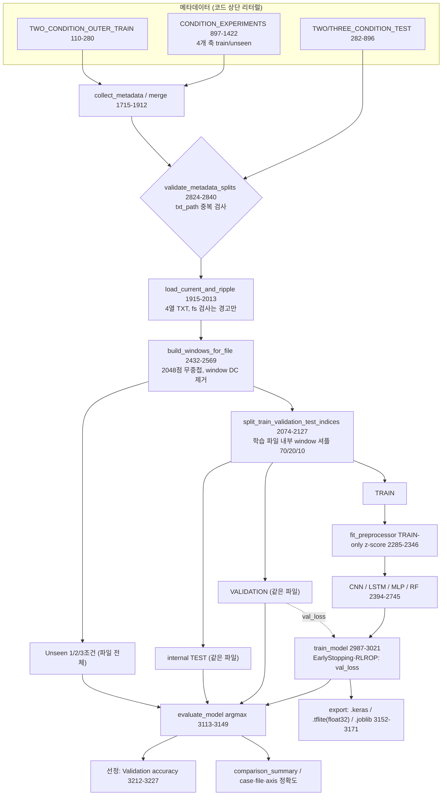

# 04. 커패시터 노화진단 AI 코드 감사 (Agent E·F·G 통합 + Lead 실행 검증)

- 작성일: 2026-10-07
- 대상 코드(원본은 읽기만 했고 수정하지 않음 — sha256 동일 확인)
  - **코드①** `…_____train80.py` (3,491행, 이하 "train80"): 실행 가능한 전체 스크립트. 행 번호는 이 파일 기준. **단, 연구실 주 모델 자체는 아니다** — 코드 설명(17–24행, 86행)에 따르면 제공되지 않은 "첨부 CNN"의 활성 파일 목록·순서·라벨, 추가학습·테스트 구성, 2048점 window, file_uid seed=42 분할, TRAIN-only z-score를 복사하고 "PI, PI 보조 손실, 기본파 전류(I1)/부하 임피던스 계산"을 제외한 **입력·모델 비교 실험 스크립트**다(1466, 3253행). 따라서 데이터·분할·평가 구조에 관한 판정은 원 CNN에도 해당될 가능성이 높고[추정], 모델 구조·파라미터·TFLite 관련 판정은 이 스크립트에만 해당한다. "PI"의 의미는 확인되지 않는다[미확인].
  - **코드②** `…_____.py` (1,908행): train80의 1–1,908행과 거의 같으나 데이터 경로, `TWO_CONDITION_TEST_FILES`의 tek0172 활성 여부만 다르고 **1,908행 `collect_metadata` 중간에서 잘린 부분 파일**이다(업로드·복사 중 잘렸을 가능성). `ast.parse`는 되지만 신호 로딩·분할·모델·학습·평가·`main`이 없어 결과를 만들 수 없다 [확인].
- 등급: **PASS**(적절) / **WARNING**(단정할 수 없으나 논문 수준에서 추가 검증 필요) / **FAIL**(누수·잘못된 평가·구현 오류 등 명백한 문제) / **RECOMMENDATION**(필수는 아니나 신뢰도 향상).
- 표기: [확인] 코드·실행 결과로 직접 확인 / [계산] 코드 상수로 계산 / [추정] 해석·추론 / [미확인] 확인 불가.
- **실행 검증 범위**: 실측 tek*.txt 데이터는 제공되지 않았다. 따라서 실측 정확도는 하나도 확인하지 못했다. 대신 (i) 원본 코드를 **수정 없이** CLI 인자(`--data-root`, `--result-root`)만 바꿔 합성 데이터로 끝까지 실행했고(TensorFlow 2.21 / Keras 3.15, 4개 모델), (ii) 원본 함수를 import해 평가 프로토콜만 바꾸는 별도 검증 도구를 실행했다(§8). **합성 데이터 수치는 코드 동작 확인용이며 연구실 모델의 성능이 아니다.**

---

## 1. 전체 Pipeline (Figure 3)

| 단계 | 함수(행) | 입력 → 출력 | 비고 |
|---|---|---|---|
| Raw waveform | `load_current_and_ripple` (1915–2013) | TXT 4열(time, 상/부하전류, 인버터 입력전류 CH2, DC-link ripple V) → 배열 + fs_measured | 시간 정렬·중복 제거(1983–1986). fs 오차 2% 초과도 **경고만**(1999–2005) |
| Preprocessing | `preprocess_ripple_window` (2024–2038) 등 | (2048,) → (2048,) | window 평균만 제거. **진폭 보존**. LPF·resampling 없음 |
| Input construction | `build_windows_for_file` (2432–2569), `INPUT_COMBINATIONS` (1467–1477) | ripple (W,2048,1) + 상전류 (W,2048,1) + scalar [f0,fsw,V1] | A1 Ripple, A2 +상전류, B1–B7 +scalar 조합. R/L은 모델 입력 아님 |
| Windowing | 2466–2471 | `arange(0, N-2048+1, 2048)` | 20.48 ms, 무중첩, 남는 끝 샘플 버림 |
| Label | `map_label_to_binary` (1483–1494) | "정상"→0, "노화"/"노화_2"→1 | 노화 정도(C/ESR 값) 없음 |
| Split | `split_train_validation_test_indices` (2074–2127) | 파일별 `default_rng(42+tek번호)` 셔플 70/20/10 | **같은 파일의 인접 window가 세 split에 섞임** |
| Normalization | `fit_preprocessor` (2285–2346) | TRAIN 전체 스칼라 mean/std(waveform), feature별(scalar) | TRAIN-only |
| Model | 2394–2745 | CNN / LSTM / MLP / RF | §5 Table 3 |
| Training | `train_model` (2987–3021) | Adam 1e-3, batch 32, EPOCHS 15, ES patience 10 | Keras에 class_weight 없음 |
| Validation | 3005–3015 | VALIDATION의 val_loss → ES·RLROP·best weight | 같은 파일 window |
| Test | `evaluate_model` (3113–3149) | internal TEST(같은 파일 10%) | |
| Unseen test | 2231–2270, 3134–3147 | 1/2/3조건 파일 전체 → TOTAL_TEST | 파일 단위로 분리됨 |
| Metrics | `score_predictions` (3033–3110) | accuracy, weighted P/R/F1, CM, case/file/axis 정확도 | 모두 window 단위 |
| Export | `save_comparison_outputs` (3201–3292), `export_model` (3152–3171) | xlsx/csv, .keras, .tflite, .joblib | TFLite 양자화 없음 |

---

## 2. A. 데이터 구성

### 2.1 신호·샘플링·window

| 항목 | 값 | 근거 |
|---|---|---|
| 사용 신호 | DC-link 리플 전압(열3) 필수, 상/부하 전류(열1) 선택(A2), 인버터 입력전류(열2)는 비교 실험에서 제외 | 1915–1922, 1462–1465, 문서 23행 [확인] |
| 샘플링 주파수 | 명목 100 kHz (`FS_NOMINAL`, 1424), 파일별 측정값은 median dt | [확인] |
| Window 길이 / overlap | 2048점(20.48 ms) / **무중첩** (1428–1430) | [확인] |
| 주파수 분해능 | 48.8 Hz/bin | [계산] |
| window 당 기본파 주기 | 30 Hz: 0.61, 45 Hz: 0.92, 60 Hz: 1.23, 90 Hz: 1.84 주기 | [계산] window가 f0와 동기화되지 않음 |
| 스위칭 주기당 샘플 | 2 kHz: 50, 8 kHz: 12.5, 14 kHz: 7.1 | [계산] |
| 토폴로지·리플 측정 지점·coupling·Vdc·커패시터 종류·C/ESR 값·온도·개체 ID | **코드에 기록 없음** | [미확인] 코드에 NPC, C1/C2 관련 단어 없음 |

### 2.2 파일·운전조건 (활성 항목, ast로 리터럴만 추출)

| 역할 | 파일 수(정상/노화) | 운전점 (f0 Hz, fsw Hz, V1 V_LL,rms) | 행 |
|---|---|---|---|
| Train — fsw축 | 4 (2/2) | (60, 14000, 100), (60, 2000, 100) | 910–969 |
| Train — f0축 | 4 (2/2) | (90, 8000, 100), (30, 8000, 100) | 1052–1111 |
| Train — V1축 | 4 (2/2) | (60, 8000, 50), (60, 8000, 200) | 1192–1233 |
| Train — R축 | 4 (2/2) | (60, 8000, 100) ×2 (R1, R4 — **R 값 미기재**) | 1295–1355 |
| Train — 2조건 outer | 6 (3/3) | (40, 4000, 100), (40, 8000, 135), (60, 4000, 135), R=32 Ω, L=18 mH | 112–194 |
| **Train 합계** | **22 (11/11)** | 정상·노화가 같은 운전점에서 **1개씩** 쌍(11쌍) | |
| Unseen 1조건 | 10 (5/5) | reference (60,8000,100), fsw 5000, f0 45, V1 125, R3 | 975–1419 |
| Unseen 2조건 | 17 (8/9) | 9 case; case1=case7, case3=case8, case5=case9는 같은 운전점의 반복 녹화. **case9는 노화(tek0182)만** — 정상 tek0172 주석 처리(476–488) | 282–528 |
| Unseen 3조건 | 8 (4/4) | (50,6000,110), (50,7000,115), (45,6000,120), (45,5000,125) | 783–895 |

[확인] train과 unseen/2조건/3조건 사이에 같은 file_key(tek 번호)는 없다. [확인] 1조건 unseen 중 reference(tek0017/0041)와 R3(tek0025/0033)의 scalar (60, 8000, 100)은 R축 TRAIN 4파일과 같다 — scalar 관점에서 "미관측"이 아니다.

---

## 3. B. 데이터 누수 검증

| # | 검사 항목 | 판정 | 근거(행) | 설명 |
|---|---|---|---|---|
| B1 | 동일 원본 파일의 window가 train/validation/test에 동시에 들어가는가 | **FAIL** (internal VALIDATION/TEST 기준) | 2074–2127, 2146–2186, 2466–2471, 문서 19–20행 | [확인] 분할 단위가 파일 내부 window이고, 연속 블록이 아니라 무작위 셔플이며 경계 gap이 없다. 합성 실행에서 학습 파일 22/22개가 세 split 모두에 들어갔고, held-out window의 94%(79/84)는 바로 옆 window가 TRAIN이었다(Agent E). **라벨과 무관하고 파일 지문만 있는 합성 데이터에서 이 split을 쓰면 VALIDATION 96.8–100%, TEST 95.5%, Unseen 48–62%** 가 나왔다(Agent E 보조 실험, 3 seed). 즉 internal VALIDATION/TEST 정확도는 노화가 아니라 "녹화 파일 식별"만으로도 높게 나올 수 있다. 코드 설명(19–20행)이 이를 의도된 설계로 밝히고 있으므로 구현 오류는 아니지만, **internal TEST를 일반화 성능으로 보고하면 잘못된 평가**다. Unseen 1/2/3조건은 파일 단위로 분리되어 이 문제와 무관하다 |
| B2 | normalization mean/std를 validation/test까지 사용해 계산하는가 | **PASS** | 2974, 2296–2335 | [확인·실행] 저장된 `wave_std`(1.155856)가 TRAIN만으로 재계산한 값과 같고, TRAIN+VAL+TEST(1.154876)·전체(1.118241)와 다르다. scalar mean/std도 TRAIN-only와 일치(Agent E). 다만 window별 전처리는 평균만 빼므로 **진폭이 그대로 남는다**(§6 물리 검토) |
| B3 | unseen 조건 데이터가 model selection에 사용되는가 | **PASS** (코드 수준) | 3005–3015, 3125, 3136–3147, 3212–3227 | [확인] ES·RLROP는 VALIDATION val_loss, 자동 선정은 validation accuracy, 판정은 argmax(0.5) 고정. Unseen은 평가·보고에만 쓰인다 |
| B4 | test 결과를 보고 hyperparameter·구성을 수정하도록 설계되어 있는가 | **WARNING** | 3174–3198, 3391–3397, 196–279, 530–776, 476–488 | [확인] 비교표 셀이 "Validation / Internal Test / Unseen case mean"으로 세 값을 나란히 보여준다. [확인] 주석 이력상 tek0145/0146/0159/0160(이전 outer-train 후보 → 현재 2조건 TEST)과 tek0163–0165/0173–0175(이전 2조건 TEST → 현재 outer-train)의 **역할이 서로 바뀌었고**, 다른 판(코드②)과 비교하면 tek0172가 제외되었다. 변경 사유는 기록이 없다 [미확인]. Unseen을 보고 구성을 바꿨다면 Unseen은 더 이상 깨끗한 test가 아니다(test-set reuse) |
| B5 | 파일 이름이나 condition metadata가 label proxy 역할을 하는가 | **PASS**(scalar 직접 proxy) / **WARNING**(녹화·개체 교락) | 2514–2518, 897–1421, 110–194 | [확인] 파일명·tek 번호는 모델 입력이 아니다. 학습 11쌍 모두 같은 운전점의 정상 1 + 노화 1이라 scalar 분포가 라벨별로 동일 → scalar만으로는 학습 라벨을 맞힐 수 없다. [추정] 그러나 조건마다 정상 1파일·노화 1파일뿐이라 **"녹화 세션·장착 상태·커패시터 개체 = 라벨"이 완전히 교락**된다(§6.3) |
| B6 | 학습 파일과 test 파일의 동일 file_key 중복 | **PASS**(현재 활성 목록) / **WARNING**(탐지 메커니즘) | 2824–2840, 1586, 1836–1910 | [확인·실행] 교집합 ∅. `validate_metadata_splits`는 소문자 `txt_path`를 비교하므로 같은 폴더의 중복은 탐지한다. 다른 폴더의 같은 tek 번호, 이름만 다른 동일 내용 파일, **같은 운전점 근접 재녹화**는 탐지하지 못한다(Agent E 실증 C5/C6) |

---

## 4. C. 모델 비교 공정성

| # | 항목 | 판정 | 근거(행) | 설명 |
|---|---|---|---|---|
| C1 | 동일 데이터 split | **PASS** | 2843–2970, 2963–2966 | 1회 생성·read-only freeze·SHA256 fingerprint. 모든 모델·조합이 같은 split 사용 |
| C2 | 동일 입력 | **PASS(형식) / WARNING(유효 정보)** | 2411–2430, 2740–2745, 2710–2712 | 같은 배열을 쓰지만 LSTM 앞 `AveragePooling1D(4)`는 등가 25 kHz 데시메이션이다. 14 kHz 성분은 이득 0.58로 줄고 11 kHz로 alias된다[계산]. LSTM은 다른 대역 정보를 본다 |
| C3 | normalization 동일 | **PASS** | 2973–2984 | 조합마다 TRAIN으로 재적합, 모델 간 동일 |
| C4 | hyperparameter / capacity | **WARNING** | 74–81, 2394–2408, 2695–2737 | 학습 가능 파라미터(A1, Keras summary 실측): **CNN 11,298 / LSTM 5,474 / MLP 271,042**, RF 200 full-depth tree. 모델별 튜닝 없음 → "모델 계열" 비교가 아니라 "이 특정 설정끼리"의 비교 |
| C5 | 입력 표현 적합성 | **WARNING** | 2740–2745, 2717–2723 | RF·MLP는 원파형 2048점을 flatten한다. window 시작이 기본파 위상과 무관하므로 같은 위치 샘플의 의미가 매번 다르다. CNN(GAP)만 이동 불변이다. (참고: 합성 라벨 데이터에서 코드의 RF는 Validation 77%, 같은 split의 FFT 특징 RF는 100%였으나(Agent E), 이는 B1에서 FAIL로 판정한 internal VALIDATION 수치이므로 입력 표현 효과의 근거로는 약하다. unseen 기준 비교는 §8.4 참조.) `max_features="sqrt"`라 분기마다 scalar가 후보에 들 확률 ≈2.2% → RF에서 B 조합 효과가 희석[계산] |
| C6 | Training epoch / early stopping | **WARNING** | 1444, 1448, 3005–3010 | EPOCHS=15, patience=10 → best val_loss가 5 epoch 이내일 때만 ES가 발동해 사실상 15 epoch 고정. `restore_best_weights=True`는 **Keras 3.15 소스에서 학습 종료 시 항상 복원됨을 확인**했으나, tf.keras 2.x 일부 버전은 조기종료가 발동할 때만 복원한다 → `run_config.json`의 `tensorflow_version`(3477)으로 확인 필요 |
| C7 | Random seed / 반복 | **FAIL**(모델 순위 주장 기준) | 2679–2684, 2990, 2995 | seed 42 단일 실행, init seed와 split seed가 같은 상수, `enable_op_determinism` 없음. 반복 실행이 없으므로 모델 간 차이와 seed 분산을 구분할 수 없다 |
| C8 | Class weighting | **WARNING** | 80, 2994, 3012–3015 | RF만 `balanced`, Keras는 없음. 파일 수는 11/11로 균형이나 window 수는 파일 길이에 좌우 [미확인] |
| C9 | Validation 사용 비대칭 | **WARNING** | 3005–3015, 2992–3001, 3216–3221 | Keras는 validation으로 best epoch를 고르고 RF는 쓰지 않는다. 그런데 선정은 모든 모델을 validation accuracy로 비교 → Keras 쪽 낙관 편향 |
| C10 | 선정 동점 처리 | **WARNING** | 3216–3227 | validation이 포화(≈100%)하면 "입력 수 적은 것 → combination_id 사전순"이 선정을 좌우한다. 합성 null 실행에서 B1/B3가 69.35% 동률이었고 ID 순으로 B1이 선정되었다(Agent E) |
| C11 | 조합별 구조 일관성 | **WARNING** | 2730–2734 | MLP는 A1에서만 fusion Dense(32)가 없다 → A1 vs B 비교에 "입력 추가"와 "층 추가"가 섞임 |

### Table 3. CNN / LSTM / MLP / RF 비교 (코드 기준)

| 항목 | CNN | LSTM | MLP | RF |
|---|---|---|---|---|
| 구조(행) | Conv1D 16(k7)→32(k5,s2)→64(k3,s2), 각 BN+LeakyReLU → GAP → [scalar Dense16] → Dense32 → Dropout 0.3 → softmax (2394–2408, 2571–2667) | AvgPool1D(4) → LSTM(32) → [scalar] → Dense32 → Dropout → softmax (2708–2735) | Flatten(2048) → Dense128-BN-Drop → Dense64-BN-Drop → (A1은 바로) softmax (2717–2735) | 200 trees, max_depth=None, sqrt, balanced (76–81) |
| 학습 파라미터 (A1) | 11,298 (+BN 비학습 224) [실행 확인] | 5,474 [실행 확인] | 271,042 (+384) [실행 확인] | 학습 window 수에 비례 |
| 연산량/window | ≈6.0 M MAC [계산, Agent F] | ≈2.2 M MAC, 512 step 순차 | ≈0.27 M MAC | tree 깊이 × 200 |
| 수용영역·대역 | **15 샘플 = 150 µs** 국부 패턴의 전역 평균, 위상 불변, 진폭 민감 [계산] | 12.5 kHz 이상 감쇠·alias | 위치 고정 가중치 | 샘플 위치별 임계값 |
| 장점 | 파라미터 적음, 위상 비정렬 window에 적합 | 파라미터 최소 | 구현 단순 | 튜닝 거의 불필요, 특징 중요도 |
| 한계 | 기본파 주기(11–33 ms)를 직접 못 봄, 센서 이득에 민감[추정] | 대역 손실, 15 epoch 부족 가능 | 과적합 위험, 위상 변화에 약함 | raw 입력 부적합, scalar 희석 |
| Edge 적합성 | 높음: float32 약 45 KB, int8 약 12 KB[계산]. TFLite 변환 성공[실행] | 낮음: TFLite 변환이 `SELECT_TF_OPS`(Flex) 사용(3165–3167) → TFLite Micro 탑재 어려움 | 중간: 가중치 float32 약 1.1 MB | 낮음: 코드에 TFLite 경로 없음(joblib) |
| 비교 공정성 메모 | 대역·불변성 면에서 유리한 설계 | 대역 손실로 불리 | 위치 의존·과대 용량 | 표현 방식이 불리 → 특징 기반 RF 추가 필요 |

---

## 5. D. 일반화 성능 검증 설계

### 5.1 내삽인가 외삽인가 (Agent F 계산, Lead 재확인)

| 축 | 학습 값(outer 포함) | Unseen 값 | 판정 |
|---|---|---|---|
| fsw | 2000, 4000*, 8000, 14000 Hz | 5000 Hz / 8000 Hz(reference) | 5000: **내삽**(4000과 Δ1000). 8000: 학습에 있음 → unseen 아님 |
| f0 | 30, 40*, 60, 90 Hz | 45 Hz | **내삽**(40과 Δ5) |
| V1 | 50, 100, 135*, 200 V | 125 V | **내삽**(135와 Δ10) |
| R | R1, R4 (값 미기재) | R3 | [미확인] — R 값이 코드에 없음 |
| 2조건 | — | 6개 운전점 | 모두 학습 convex hull **안**. case1·7 (45,5000,100)과 case2 (50,6000,100)은 outer (40,4000,100)과 중심 (60,8000,100)을 잇는 **선분 위에 정확히** 있다 |
| 3조건 | — | 4개 운전점 | 모두 hull 안. outer TRAIN을 빼면 case3·4는 hull 밖 |

(*: 2조건 outer TRAIN에만 있는 값)

**결론 [계산]**: 현재 코드의 "unseen" 시험은 **학습 범위 안의 미학습 조합 내삽**을 측정한다. 학습 범위 밖(예: fsw > 14 kHz, V1 > 200 V, f0 < 30 Hz) 외삽 성능은 **측정되지 않는다.** 논문에서는 "operating-condition generalization" 대신 "interpolation to unseen operating points within the training range"라고 써야 정확하다.

### 5.2 조건별 지표 산출 여부

| 지표 | 산출 여부 | 근거 | 판정 |
|---|---|---|---|
| Accuracy | 산출(전체, case, file, axis) | 3039–3047, 3104 | PASS |
| Precision / Recall / F1 | **weighted 평균만** 요약표에 저장. class별 값은 `classification_report` JSON | 3038, 3102 | WARNING — 노화 recall(놓침)과 정상 specificity(오경보)를 요약표에 분리해야 함 |
| Confusion Matrix | split별 CSV/PNG | 3089–3101 | PASS |
| 조건별(case) 성능 | case mean/min, axis 정확도 | 3039–3077 | PASS(+주의: reference가 모든 축 요약에 반복 포함 3049–3077) |
| 파일 단위 판정 | window 정답률만, 다수결·확률 평균 판정 없음 | 3042–3044 | WARNING |
| 신뢰구간 / 반복 seed / 유의성 검정 | 없음 | — | **FAIL**(통계적 주장 기준) — 유효 표본은 파일 수(unseen 35)이며, 35/35를 모두 맞혀도 Clopper–Pearson 95% 하한은 90.0%, 3조건 8/8은 63.1% [계산, Agent F]. (검증 도구는 Wilson 구간을 출력한다. 둘 다 이항 비율 구간이며 소표본에서는 Clopper–Pearson이 더 보수적이다.) |
| In-distribution vs OOD 차이 | Validation / Internal Test / Unseen을 나란히 출력 | 3174–3198 | PASS(출력 구조) — 단 internal TEST는 OOD 대비 기준이 아니라 "같은 녹화" 기준임을 명시해야 함 |

---

## 6. 물리적 타당성 (Agent G 통합)

### 6.1 입력 신호와 열화의 관계 [가정값 기반 해석]

- DC-link 리플 전압 ≈ i_C·(ESR + jωESL + 1/(jωC)). 전해 커패시터 가정값(C=1000 µF, ESR=50 mΩ)에서는 fsw 대역(4–14 kHz)에서 ESR 항이 X_C보다 커서 **fsw 대역 리플 ≈ ESR·i_C**이다. 노화(C −20%, ESR ×2) 시 |Z(8 kHz)|는 약 ×1.9, 저주파(120–360 Hz)는 약 ×1.25로 변한다 [가정·계산]. 필름 커패시터라면 노화에 따른 리플 변화는 약 5% 수준이다 [가정]. **커패시터 종류는 코드에서 확인되지 않는다.**
- 같은 가정에서 운전조건 효과는 노화 효과와 같거나 크다: V1 50→200 V에서 커패시터 전류 실효값 약 ×5, fsw 2→14 kHz에서 전해 |Z| 약 ×0.54 [가정·근사식]. 예: 노화 @100 V와 정상 @200 V의 8 kHz 리플 진폭이 비슷해질 수 있다 → **진폭만으로는 노화와 운전조건을 구분할 수 없다.**
- 전처리는 진폭을 보존한다(2037, 2302–2304) [확인]. CNN 수용영역은 150 µs로, 스위칭 순간의 ESR·i_C step과 i_C/C ramp 같은 국부 형상을 볼 수 있지만, 같은 순간에 **ESL·배선·프로브 루프가 만드는 스파이크(장착 상태 의존)**도 겹친다 [추론].

### 6.2 "AI가 노화를 학습했는가, 운전조건을 학습했는가"

| 질문 | 판단 | 근거 |
|---|---|---|
| 운전조건이 라벨의 직접 지름길인가 | **아니다** | 학습 11쌍이 모두 같은 조건의 정상·노화 쌍, scalar 분포가 라벨별로 동일 [확인] |
| internal VALIDATION/TEST 정확도가 노화 학습의 증거인가 | **아니다** | 같은 파일의 인접 window(B1). 파일 식별만으로 95% 이상 가능(합성 실증) |
| 3조건 test가 장착 상태 면에서 독립적인가 | **아니다** | 3조건 8파일 모두 outer TRAIN과 같은 측정 블록(tek0163–0182) [확인 + 블록 구분은 추론] |
| 노화 vs 개체·장착 상태를 구분할 수 있는가 | **현재 데이터·코드로는 불가** | 커패시터 개체 ID·C/ESR·온도 기록 없음. 정상·노화 개체가 각 1개라면 결과는 "두 개체 구별"과 원리적으로 구분 불가 [미확인] |

### 6.3 측정 순서(tek 번호)와 라벨 — 측정 교락 위험

- [확인] 전역 corr(tek 번호, 라벨) = 0.075(학습 0.029) — 노화가 특정 번호대에 몰려 있지는 않다.
- [추론] 그러나 블록 안에서는 라벨이 덩어리로 측정되었다(예: tek0163–0172 정상 → tek0173–0182 노화, 같은 조건 순서로 정확히 +10 간격; tek0219–0224 노화 → tek0225–0228 정상). 블록 안에서 **라벨 ≡ 커패시터 교체(장착) 이벤트**다.
- [계산] 측정 순서만으로 unseen 라벨을 예측하는 1-NN 기준선(가장 가까운 학습 tek 번호의 라벨): 1조건 6/10, 2조건 9/17, **3조건 7/8(+동점 1)**, 전체 22/35. 전체적으로는 강한 예측자가 아니지만, 3조건 test는 측정 순서만으로 거의 맞힐 수 있다. 따라서 3조건 결과가 좋다면 운전조건 일반화보다 **같은 측정 블록 효과**를 먼저 의심해야 한다.
- [해석] 블록 B·D는 정상을 먼저, 블록 E는 노화를 먼저 측정해 시간 drift(예열) 교락은 일부 상쇄되지만, 장착 이벤트 교락은 없앨 수 없다.

### 6.4 FFT / PSD / 시간·고조파 특징 관점의 분석 방안

| 분석 | 방법 | 판별 기준 |
|---|---|---|
| 쌍별 PSD 차이 | 파일 전체 Welch(Hann, nperseg 16384, Δf≈6 Hz)로 fsw±3f0, 2fsw, 2fsw±6f0, 저주파(2f0, 6f0, 정류기 성분) 진폭 비교 | 노화 신호가 진짜라면 차이 스펙트럼 모양이 블록과 무관하게 일관되어야 함 |
| Effect size | `derived_window_features.csv`(2555–2559)의 ripple_rms·p2p로 D_age(같은 쌍) vs D_rep(같은 운전점 다른 블록: 0153↔0170, 0154↔0171, 0150↔0180, 0151↔0181, 0157↔0182) vs D_cond | |D_rep| ≳ |D_age|이면 반복 측정 변동이 노화 효과만큼 큼 |
| 물리 기반 정규화 특징 | CH2가 인버터 측 전류라면 Ẑ(fsw)=−S_v,i/S_i,i → ESR=Re Ẑ, C≈−1/(ω Im Ẑ). 아니면 리플 대역 진폭/상전류 rms | 운전조건 강건 지표. 단순 지표가 CNN과 비슷하면 CNN이 물리 지표를 학습했을 가능성↑ |
| 대역 occlusion / Grad-CAM | FFT 대역을 0으로 만든 뒤 Δp(aged), `ripple_conv3` Grad-CAM | 모델이 fsw 대역(ESR)을 보는지, 스위칭 스파이크(장착 서명)를 보는지 |
| 진폭 스케일링 | 원신호 × g (0.25–4) → p(aged) 곡선 | 정상 파일이 g≈1.5–2에서 노화로 뒤집히면 진폭 규칙 의존 |
| per-window 정규화 ablation | window별 x/rms(x), 상전류 rms 정규화 버전 재학습 | 진폭 제거 후에도 유지되면 형상 학습 |

---

## 7. 구현 리스크 (기타)

| 항목 | 등급 | 행 | 설명 / 개선안 |
|---|---|---|---|
| 샘플링 주파수 불일치 | WARNING | 1999–2005 | 2% 초과도 경고만 출력하고 포함(125 kHz 합성 파일로 실증). → 오류 처리 또는 리샘플 |
| window 수가 적은 파일 | WARNING | 2085–2125 | n=3 → 1/1/1, n=2 → 오류. 파일별 window 수 보고 필요 |
| case_id 짝 불일치 | WARNING | 1218, 1228, 2757–2781 | `v_4_normal`(tek0226)과 `v_3_aged`(tek0223)가 다른 case로 분리 → 단일 클래스 case 발생 |
| 주석과 활성 항목 불일치 | RECOMMENDATION | 898–903 등 | 블록 주석("Train: fsw1+fsw3, Unseen: fsw2")과 실제 이름(fsw1/fsw4 train, fsw3 unseen) 불일치. `MODEL_TYPES=["CNN"]`(70)인데 주석은 "4개 모델 전체 비교" |
| 파일명과 비율 | RECOMMENDATION | 1436 | 파일명 "train80"과 `TRAIN_RATIO=0.70` 불일치 — 어떤 판의 결과인지 기록 필요 |
| Keras 3 경고 | RECOMMENDATION | 2398 등 | `LeakyReLU(alpha=…)`는 Keras 3에서 deprecated 경고(실행 확인) → `negative_slope` |
| TFLite | RECOMMENDATION | 3162–3171 | float32 변환만, 양자화·Keras↔TFLite 출력 동등성 검증 없음. LSTM은 Flex op 필요 |
| fs·Vdc·온도 메타데이터 | RECOMMENDATION | — | 측정 조건(Vdc, 표면온도, 커패시터 ID, 측정 시각)을 metadata에 추가 |

---

## 8. 실행 검증 결과

### 8.1 원본 코드 무수정 실행 (Lead, TensorFlow 2.21 / Keras 3.15, 합성 데이터)

- 명령: `python -I <train80.py> --data-root <합성 TXT> --result-root <출력> --models CNN LSTM MLP RF --combinations A1 A2 B7`
- 결과 [확인]: 4개 모델 × 3개 조합 = 12개 실행 모두 성공, 결과 구조(comparison_summary.xlsx/csv, case·file·axis 정확도, 혼동행렬, model.keras, **model.tflite(CNN·LSTM·MLP 모두 생성)**, preprocessor.npz)가 문서(26–33행) 설명과 일치.
- 합성 데이터(파일당 9 window)에서 validation 순위와 unseen 순위가 일치하지 않았다(예: RF-A1 validation 79.5% / unseen case mean 98.8%, CNN-B7 validation 72.7% / unseen case min 0%). **이 수치는 합성 데이터의 동작 확인일 뿐이며 연구실 모델 성능이 아니다.** 시사점은 "같은 파일 window로 만든 validation과 파일 단위 unseen 성능이 서로 다른 것을 측정한다"는 점이다.

### 8.2 Agent E 실행 (scikit-learn, 원본 복사본, 합성 데이터)

| 데이터 | VALIDATION | internal TEST | Unseen 전체 | 파일 식별 정확도(chance 4.5%) |
|---|---:|---:|---:|---:|
| null(라벨 무관, 파일 지문만) seed 7 | 96.8 | 95.5 | 59.2 | 97.6 |
| null seed 11 | 100.0 | 95.5 | 48.0 | 97.6 |
| null seed 23 | 98.4 | 95.5 | 61.8 | 97.6 |

(FFT 64대역 + RF, 원본 split manifest 재사용) → **파일 내부 분할의 VALIDATION/TEST는 라벨 정보가 전혀 없어도 95% 이상이 될 수 있다.**

### 8.3 Lead 검증 도구 (원본 함수 재사용, 평가 프로토콜만 변경)

`verification_code/capacitor_ai_validation_toolkit.py` — 실험 E1(원본 split 재현), E2(조건쌍 단위 LOCO), E3(조건쌍 단위 라벨 뒤집기), E4(조건만/진폭만/스펙트럼 모양 기준선), E5(잡음), E6(센서 이득), E7(seed 반복). 합성 데이터 실행 결과는 §8.4에 정리한다.

### 8.4 검증 도구 실행 결과 (합성 데이터 — 메커니즘 예시)

- 합성 데이터: `verification_code/synthetic_inverter_data.py`로 원본 코드의 활성 파일 목록 57개를 그대로 만들었다(2-level SPWM 3상 인버터 + RL 부하 + C·ESR DC-link, 정상 C=1000 µF/ESR=0.1 Ω, 노화 C −20%/ESR ×2, 파일당 46 window). §6.1의 물리 예시(ESR 50 mΩ)와는 서로 다른 임의 가정값이다. **모든 소자값은 임의 가정이며, 측정 블록·장착 상태 효과는 넣지 않았다.** 따라서 아래 수치는 "평가 프로토콜이 무엇을 측정하는가"를 보이는 예시일 뿐이다.
- 지표: 파일 단위 다수결 정확도(Figure: `figures/fig_synthetic_protocols.png`, `fig_synthetic_gain.png`, 원자료 `data/synthetic_validation_results.csv`).

| 실험 | CNN(원본 구조) | RF raw(원본 구조) | RF 스펙트럼 모양(보조) | 관찰 |
|---|---:|---:|---:|---|
| E1 internal TEST(같은 파일) | 95.5 | 86.4 | 100 | |
| E1 Unseen 전체(내삽) | 85.7 | 100 | 97.1 | internal TEST에서는 CNN 21/22(Wilson 95% CI 78–99%)와 RF 19/22(67–95%)의 구간이 겹치지만, unseen에서는 RF 35/35(90–100%)와 CNN 30/35(71–94%)가 겹치지 않음. 같은 RF라도 log 대역 에너지 입력은 85.7% |
| E2 LOCO(조건쌍 통째 제외, 11 fold, fold당 2파일 → fold 정확도는 0/50/100%만 가능) | 68.2 ± 25.2 | 81.8 ± 25.2 | 86.4 ± 23.4 | CNN은 7/11 fold(V1 50/200 V, R1, R4, f0 90 Hz, fsw 2 kHz, outer 40 Hz·4 kHz)에서 50%, 경계 fold인 fsw 14 kHz·f0 30 Hz에서는 100% → 경계만으로 설명되지 않으며 분산이 큼. R 값은 합성 가정값 |
| E3 라벨 뒤집기 후 internal TEST(뒤집힌 라벨 기준, 3회) | 83.3 | 92.4 | 100 | **무의미한 라벨도 internal TEST에서는 높게 맞힘** → internal TEST는 녹화 식별을 측정 |
| E3 라벨 뒤집기 후 Unseen(실제 라벨 기준) | 45.7 | 31.4 | 55.2 | 우연 수준 부근 또는 이하 |
| E4 운전조건만(COND_ONLY) | Unseen 48.6 | | | scalar shortcut 없음(설계대로) |
| E4 진폭(log rms)+운전조건 로지스틱(AMP_ONLY) | Unseen 100 | | | 합성 세계에서는 단순 진폭 기준선이 CNN 이상 → DL의 이득은 기준선 대비로 보여야 함 |
| E6 센서 이득 ×0.8 / ×0.9 / ×1.2 | 54.3 / 62.9 / 100 | 97.1 / 100 / 82.9 | 82.9 / 97.1 / 97.1 | **CNN은 이득을 낮추면 노화 recall이 0.72(공칭) → 0.30(×0.9) → 0.11(×0.8)로 급락**. 같은 진폭 보존 입력의 RF raw는 ×0.8–1.1에서 견고 → 원인(진폭 보존 vs 한쪽 방향 임계값 편향)은 per-window 정규화 ablation으로 확인 필요 |
| E5 잡음 SNR 10 dB | 88.6 | 100 | 97.1 | 잡음보다 이득 오차가 더 큰 위험 |
| E7 seed 3회 Unseen 전체 | 82.9 ± 9.9 | 100 ± 0 | 97.1 ± 0 | CNN 단일 seed 결과로 순위를 매기기 어려움 |

해석 원칙: 위 결과로 "RF가 CNN보다 낫다"고 결론 내리면 안 된다(합성 데이터는 노화가 진폭을 2배로 만드는 단순한 세계이며 RF raw가 유리하게 설계되어 있다). 이 결과가 보여 주는 것은 **(1) internal TEST는 라벨이 무의미해도 높을 수 있고, (2) 평가 프로토콜에 따라 모델 순위가 바뀌며, (3) 진폭 보존 CNN은 센서 이득에 민감할 수 있다**는 메커니즘이다. 연구실 실측 데이터에 같은 도구를 그대로 실행하면(명령은 `verification_code/README.md`) 실제 답을 얻을 수 있다.

---

## 9. Table 4. 현재 코드 검증 결과 요약

| 영역 | 항목 | 판정 | 핵심 근거(행) |
|---|---|---|---|
| 구조 | 코드② 부분 파일(1,908행 절단) | N/A(제공 파일 불완전: 실행되나 결과 산출 불가) | 코드② 1908 |
| 누수 | 같은 파일 window의 train/val/test 혼입 | **FAIL**(internal 지표의 해석) | 2074–2127 |
| 누수 | 정규화 TRAIN-only | PASS | 2285–2346, 2974 |
| 누수 | Unseen의 선정·조기종료 사용 | PASS | 3005–3015, 3212–3227 |
| 누수 | test 결과 기반 구성 변경 위험 | WARNING | 196–279, 530–776, 476–488 |
| 누수 | scalar의 label proxy | PASS / 녹화·개체 교락 WARNING | 2514–2518 |
| 누수 | train∩test 파일 중복 | PASS / 탐지 한계 WARNING | 2824–2840 |
| 공정성 | 동일 split·정규화 | PASS | 2843–2984 |
| 공정성 | capacity·입력 표현·LSTM 대역 | WARNING | 2394–2745 |
| 공정성 | seed 반복 없음 | **FAIL**(순위 주장) | 2679–2684 |
| 공정성 | EPOCHS 15 / patience 10 / restore | WARNING | 1444–1448, 3005–3010 |
| 일반화 | unseen = 범위 내 내삽, 외삽 미측정 | WARNING | 897–1422, 110–896 |
| 일반화 | reference/R3 scalar가 학습점과 동일 | WARNING | 975–1004, 1401–1419 |
| 평가 | window 단위 지표만, CI·유의성 없음 | **FAIL**(통계 주장) | 3033–3110 |
| 평가 | weighted P/R/F1, 파일 다수결 없음 | WARNING | 3038, 3042–3044 |
| 물리 | 진폭 보존 → 운전조건 진폭 효과에 노출 | WARNING | 2037, 2302–2304 |
| 물리 | 노화 vs 개체·장착 상태 구분 불가 | WARNING(데이터 설계) | 메타데이터 전반 |
| 구현 | fs 불일치 경고만 | WARNING | 1999–2005 |
| 구현 | case_id 짝 불일치 | WARNING | 1218, 1228 |
| Edge | TFLite float32, LSTM Flex op | RECOMMENDATION | 3162–3171 |

---

## 10. 코드 검증 실험 제안 (Experiment 1–10 + 보조 3종)

공통: 파일 단위 판정(window 확률 평균)과 k/n·Clopper–Pearson 95% CI, 노화 recall·정상 specificity·balanced accuracy·AUROC, seed 5회 이상 반복(평균±SD). window 정확도는 보조 지표.

| Exp | 목적 | 학습 데이터 | 테스트 데이터 | 평가지표 | 기대 결과 [추정] | 의미 |
|---|---|---|---|---|---|---|
| 1 Same-condition random split | 상한(sanity)·인접 window 누수 크기 | 22 학습 파일 window 70% (현행) + 시간 블록 분할 변형(앞 70% / gap / 20% / gap / 10%) | 같은 파일 10% | window·파일별 정확도 | random ≈ 100%, blocked ≤ random | 녹화 내부 분리 가능성만 보여 줌 |
| 2 File-level holdout | 같은 운전점, 다른 녹화로 녹화 간 변동 분리 | 22 학습 파일 + 반복 녹화 쌍 한쪽(case1 0153/0150, case3 0154/0151, case5 0143/0157) | 다른 쪽(case7 0170/0180, case8 0171/0181, case9 0182 [+정상 0172]); 역할 교대 2-fold | 파일 정확도+CI, 반복 녹화 간 p(aged) 일치도 | Exp1보다 낮음 | 현재 unseen 결과 해석의 기준점 |
| 3 Operating-condition holdout | 축별 미학습 값 내삽 | (a) 1조건 축 16파일만(outer OFF) (b) 22파일(현행) | 1조건 unseen 8파일 (reference 별도 보고) | 축별 파일 정확도, (b)−(a) | (b) ≥ (a) | outer TRAIN 기여량 정량화 |
| 4 Leave-one-condition-out | 조건별 일반화 분포·외삽 | 57파일을 운전점 그룹으로 묶어 하나씩 제외(inner validation도 그룹 단위). **경계값 fold**(f0=30/90, fsw=2k/14k, V1=50/200 제외) 포함 | 제외된 그룹 | fold별 파일 정확도, 평균±SD, worst-fold, 학습점까지 거리 vs 정확도 | 내부 fold 높음, 경계 fold 낮음 | 내삽/외삽을 실제로 구분 측정 |
| 5 Two-condition shift | 결합 변화 일반화 | (a) 22 (b) 16 (c) 16 + 2조건 test 쌍 | 2조건 17파일; (c)는 outer 6파일 | case·파일 정확도 | (a) > (b) | outer 근접 내삽 효과 분리 |
| 6 Three-condition shift | 3조건 변화 | (a) 22 (b) 16 (c) 측정 블록 통제 | 3조건 8파일 | 파일 정확도, hull 안/밖 층화 | (b)에서 case3·4 하락 | 블록 공유 효과 확인 |
| 7 Noise robustness | 측정 잡음 강건성 | clean / 잡음 증강 | unseen 원파형에 AWGN SNR 40/30/20/10 dB, ADC 8/10/12 bit 양자화 모사 | 정확도·AUROC vs SNR | CNN이 MLP/RF보다 완만한 저하 | Edge ADC·현장 잡음 한계 |
| 8 Sensor scaling/error | 센서 이득·오프셋·fs 오차 | clean / gain 증강 | 리플 × g ∈ {0.8…1.2}, DC offset(영향 0이어야 함), fs ±1–2% | 정확도 vs g, 판정이 뒤집히는 g | 진폭 보존이므로 민감 | 센서 공차 요구사항 도출 |
| 9 Different capacitor sample | 노화 진단 vs 개체 식별 | 개체 ID별 그룹(정상 ≥3, 노화 ≥3, 또는 C −10/−20%, ESR ×1.5/×2 단계) | 미학습 개체(leave-one-capacitor-out) | 개체별 정확도, p(aged) vs LCR C/ESR 상관 | 개체 서명 의존 시 크게 하락 | **노화 진단 주장에 필수** |
| 10 Different hardware/inverter | 장치 간 이전성 | 현 장비 | 다른 인버터·보드·프로브·스코프; zero-shot → 정상 데이터 재정규화 → few-shot | 정확도, AUROC, ECE, 필요한 target 데이터 양 | zero-shot 하락 | 제품·Edge 적용성 |
| A Label-permutation | 파이프라인 누수 검출, 귀무분포 | 학습 라벨을 조건쌍 안에서 무작위 교환(K회) | internal VAL/TEST, unseen | p = (1+#null≥obs)/(K+1) | internal은 높게 유지, unseen ≈ 50% | internal 지표가 "파일 식별"임을 직접 증명 |
| B Condition-only / 진폭+조건 baseline | scalar·진폭 shortcut 검출 | (f0,fsw,V1)만 / ripple rms·p2p + scalar | unseen | 파일 정확도 | 조건만 ≈ 50% | 진폭+조건 기준선이 CNN과 비슷하면 DL 이득은 진폭 임계값 수준 |
| C Measurement-order baseline | 측정 블록 교락 검출 | tek 번호 또는 블록 ID | unseen | 파일 정확도 | 3조건 7/8(+동점 1) [계산] | 3조건 결과의 블록 효과 배제 필요성 |

---

## 11. 결론 (코드 감사)

1. **코드 품질 자체는 연구 코드로서 양호하다** [확인]: TRAIN-only 정규화, unseen 미사용 선정, 파일 경로 중복 검사, split fingerprint, read-only freeze, window manifest 저장 등 재현성 장치가 갖춰져 있다.
2. **가장 큰 문제는 구현 오류가 아니라 평가 설계의 해석**이다: internal VALIDATION/TEST는 같은 녹화의 인접 window이므로 일반화 근거가 될 수 없다(FAIL). 모델 선정도 이 validation에 의존한다.
3. **일반화 주장 범위**: 현재 unseen은 학습 범위 내 내삽이다. 외삽, 다른 커패시터 개체, 다른 하드웨어에 대한 성능은 측정되지 않았다.
4. **물리적 해석**: 리플 진폭은 노화와 운전조건에 같은 크기로 반응하고, 라벨은 측정 블록 안에서 커패시터 교체 이벤트와 교락되어 있다. "노화를 학습했다"는 주장에는 Exp9(다른 개체)와 PSD·effect size 분석이 필요하다.
5. **통계**: 결론의 단위는 window 수천 개가 아니라 파일 35개, 커패시터 개체 수개다. 모델 간 1–3%p 차이는 현재 설계로 입증할 수 없다.
