# 전력전자 설비 상태진단 연구에서의 인공지능 활용 현황 및 연구 적용 가능성 분석
### — 선행연구 조사, 연구실 기술 매핑, 커패시터 노화진단 AI 코드의 기술적 검증 —

- 작성일: 2026-10-07
- 대상: 중앙대학교 전력전자연구실 연구주제(창업계획서 기준)와 제공된 DC-link 커패시터 노화진단 Python 코드
- 작성 체계: 다중 에이전트(연구실 분석 A, 문헌 B1·B2·C·D, 코드 감사 E, ML 방법론 F, 전력전자 검토 G, Red Team H)가 병렬 수행한 결과를 Lead가 통합하고 교차검증함
- 세부 근거 문서: `01_lab_research_analysis.md` ~ `06_reference_verification.md`, 에이전트 원보고서 `agent_reports/`, 데이터 `data/`, 그림 `figures/`, 검증 코드 `verification_code/`

> **읽기 전 유의사항**
> 1. 선행연구는 **검색 색인(제목·초록 스니펫) 수준**에서만 확인했다. 네트워크 정책으로 출판사·DOI 서버에 접근할 수 없어 논문 본문을 한 편도 읽지 못했다. "논문에서 확인되지 않음"은 "하지 않았다"는 뜻이 아니다.
> 2. 연구실 실측 데이터(tek*.txt)는 제공되지 않았다. 코드의 **실제 정확도는 확인하지 못했다.** 이 보고서의 실행 결과는 모두 **합성 데이터**로 코드 동작과 평가 프로토콜의 메커니즘을 확인한 것이며, 연구실 모델의 성능이 아니다.
> 3. 표기: **[사실]** 문서·코드·실행으로 확인 / **[해석]** 사실의 물리적·방법론적 해석 / **[추론]** 수식·패턴에서 도출 / **[미확인]** 확인하지 못함.

---

## 요약

- **연구실 AI 활용 현황** [사실]: 계획서 기재 논문 29편 중 23편의 서지를 외부에서 확인했다. AI 사용이 스니펫으로 확인된 논문은 DC 아크(series/parallel) 진단과 커패시터 C/ESR 추정에 집중되어 있다. 소자(SiC MOSFET) 열화 논문 2편에서는 AI 사용이 확인되지 않았고, 이 영역의 AI 근거는 2026년 출원 특허(외부 미확인)에 있다.
- **선행연구** [사실]: 외부 후보 84편(중복 포함)을 탐색해 핵심 16편을 선정했다. 미관측 운전조건(부하)을 명시적으로 평가한 V1 논문은 아크 분야 2편([18], [19])뿐이었다. 다축 운전조건 변화에서 커패시터 노화의 일반화를 평가한 DL 연구와 DC-link 커패시터 노화의 MCU 온보드 신경망 진단은 이번 검색 범위에서 확인되지 않았다.
- **코드 검증 핵심** [사실·해석]
  - 코드는 TRAIN-only 정규화, unseen 미사용 선정, 파일 중복 검사, split fingerprint 등 재현성 장치를 갖춘 양호한 연구 코드다.
  - 그러나 internal VALIDATION/TEST는 **같은 녹화 파일의 인접 window**이므로 일반화 근거가 될 수 없다(FAIL). 라벨과 무관한 합성 데이터에서도 이 지표가 95% 이상 나왔다.
  - unseen 시험은 모두 **학습 범위 내 내삽**이다. 외삽, 다른 커패시터 개체, 다른 하드웨어에 대한 성능은 측정되지 않았다.
  - 학습 조건마다 정상·노화 녹화가 1개씩이고 측정 블록 안에서 라벨이 커패시터 교체 이벤트와 겹친다. 그래서 "노화를 학습했다"와 "개체·장착 상태를 식별했다"를 현재 데이터로는 구분할 수 없다.
  - 모델 순위는 단일 seed·window 단위 지표에 근거하므로 통계적으로 주장할 수 없다(FAIL).
- **결론**: 모델 종류(CNN/LSTM/MLP/RF)의 우열보다 **입력 표현, 데이터 설계(개체·블록·조건 분리), 평가 프로토콜**이 결론을 좌우한다. 추천 연구주제 1순위는 "운전조건 일반화가 검증된 DC-link 커패시터 노화진단"이다.

---

## 1. 서론

### 1.1 연구 배경
DC-link 커패시터와 전력반도체는 전력변환장치의 주요 수명 제한 부품이다. 전해 커패시터는 열화에 따라 정전용량(C)이 줄고 등가직렬저항(ESR)이 커지며, 이를 감시하는 상태진단(condition monitoring) 기법이 오래 연구되어 왔다[3][4]. 아크 고장은 저압 배전과 PV·ESS 같은 DC 설비의 화재 원인으로, 부하 조건 변화에 강인한 검출이 과제다(연구실 계획서 p.11, [18][19]).

### 1.2 AI 기술 발전과 전력전자 연구
[1]은 전력전자 AI 응용 500편 이상을 설계·제어·유지보수 단계로 분류했고, [2]는 전력전자 고장진단에서 측정 신호로부터 특징을 학습하는 DL 기법이 효과적이라고 정리했다. 최근 연구는 정확도 경쟁에서 운전조건·하드웨어 변화에 대한 일반화[10][11][12], 설명가능성[15][16], MCU 탑재[25][26][32]로 초점을 옮기고 있다.

**Figure 1. 전력전자 설비 상태진단 + AI 전체 개념도**

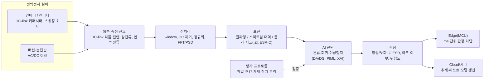

### 1.3 조사 목적
① 실제 AI 활용 선행연구 조사 → ② 연구실 연구분야 분석 → ③ 선행연구와 연구실 기술 매핑 → ④ 현재 AI 코드의 분석·검증 → ⑤ 문제점과 개선방향 → ⑥ 향후 AI 적용 연구주제 제안. 아울러 이 작업 자체를 "생성형 AI를 활용한 연구지원 사례"로 기록한다(8장).

---

## 2. 전력전자연구실 연구분야 분석

### 2.1 연구실 주요 연구주제
계획서의 핵심기술은 "엣지 AI 기반 아크진단 및 전력전자설비 예지보전 기술"이며, 보유기술을 ① AI 기반 전력변환장치 상태진단, ② AI 기반 AC/DC 아크 진단, ③ 경량화 엣지 AI 구현으로 정리한다(계획서 p.12). 현재 TRL 3이며 2026년 MVP(TRL 5)를 목표로 한다(p.15).

**Figure 2. 연구실 AI 연구영역 map** (실선 = 논문으로 AI 사용 확인, 점선 = 계획·특허 단계)

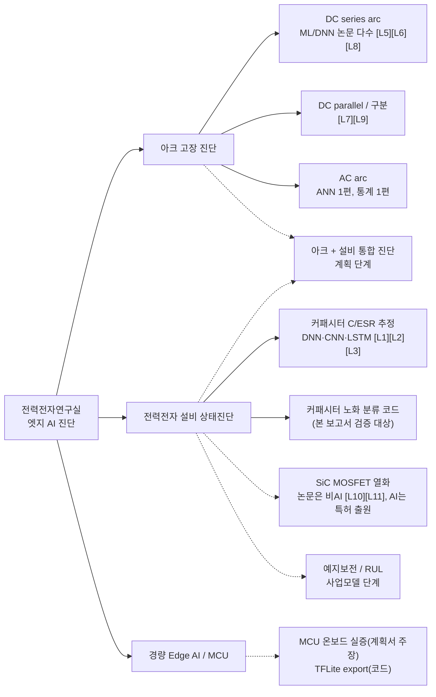

### 2.2 전력전자 설비 상태진단
계획서는 설비 **외부 신호**만으로 내부 소자 상태를 진단하고 위험도 레벨을 판단하는 것을 차별성으로 제시한다(p.2, p.12). [사실] "정확도 95% 이상", "MCU 온보드 동작 실증"의 평가 조건(데이터 분할, 미관측 부하 포함 여부, MCU 사양)은 계획서에 없다.

### 2.3 DC-link 커패시터 진단
[사실] 연구실 선행 논문은 단상[L1]·3상[L2] DC/AC 컨버터에서 FFT 성분 또는 주파수 대역 입력으로 C와 ESR을 **회귀 추정**했다. 이번에 제공된 코드는 3상 인버터 리플 전압 원파형으로 정상/노화를 **이진 분류**한다. 연구실 안에 회귀 계열과 분류 계열이 공존한다.

### 2.4 Arc fault diagnosis
[사실] 2021–2025년 DC series·parallel 아크 AI 논문이 다수 확인된다([L5]–[L9]). 다만 사용 모델은 대부분 "learning models"로만 서술되어 스니펫으로는 특정하지 못했다. 연구실은 UL1699B·IEC62606 시험환경과 아크 관련 등록특허 3건을 보유했다고 기재했다(외부 미확인).

### 2.5 Edge AI / MCU 진단
[사실] 계획서는 MCU 경량화·펌웨어 탑재 인력을 배치하고(p.14) MCU 온보드 동작 실증을 주장한다. 제공된 커패시터 코드에는 Keras → TFLite(float32) 변환까지 구현되어 있고, 양자화와 MCU 측정 결과는 없다.

### Table 1. 연구실 연구영역별 AI 활용 가능성

| 연구영역 | 현재 연구내용 | 현재 AI 사용여부 | AI 적용 가능성 | 예상 효과 | 연구 난이도 |
|---|---|---|---|---|---|
| DC-link 커패시터 노화진단 | 리플 기반 정상/노화 분류(코드), 단상·3상 C/ESR DL 추정(논문) | 사용(확인) | 상 | 미관측 운전조건에서 신뢰 가능한 진단, C/ESR 정량화 | 중 |
| 커패시터 노화 단계·RUL | 정상/노화 2단계 | 미사용 | 중 | 교체 시점 예측(BM 핵심) | 상 |
| 전력반도체(SiC MOSFET) 열화 | 열화 영향 분석 논문, AI 특허 출원 | 논문상 미확인 | 중 | 소자 열화·위치 진단 | 상 |
| DC series/parallel 아크 | 다수 AI 논문, 등록특허 | 사용(확인) | 상 | 부하 범용 검출, 오경보 감소 | 중 |
| AC 아크 | ANN 1편, 통계 1편 | 일부 | 상 | AC/DC 통합 모델 | 중 |
| 아크 + 설비 열화 통합 | 계획 단계 | 미사용 | 중 | 단일 디바이스 원인 분류 | 상 |
| Edge AI(MCU) | 동작 실증 주장, TFLite export | 일부 | 상 | 저가·실시간 현장 진단 | 중 |
| 정상 데이터 기반 이상탐지 | 없음 | 미사용 | 중 | 라벨 없는 현장 적용 | 중 |
| XAI(주파수 대역 해석) | 없음 | 미사용 | 상 | 노화 성분 학습 여부 검증 | 하~중 |
| 최적 센서/입력 선택 | 입력조합 9종 비교(코드) | 사용(ablation) | 상 | 센서 비용 절감 | 하 |

---

## 3. 전력전자 분야 AI 활용 연구동향

### 3.1 Machine Learning
전통 ML은 수작업 특징(대역 에너지, RMS 등) 기반 분류·회귀에 쓰인다. [8]은 power MOSFET 20개의 가속 시험 데이터로 RF 분류와 Bayesian Ridge RUL 회귀를 결합해 분류 평균 정확도 80%, RUL RMSPE 1.25%를 보고했다. [19]는 전류의 시간·주파수 coupling 특징과 ML 분류기로 단일 부하 학습 → 미관측 다중부하 검출을 시험했다.

### 3.2 Deep Learning
[2]는 측정 신호에서 특징을 학습하는 DL이 전력전자 고장진단에서 효과적이라고 정리했다. 인버터 DL 진단의 주 대상은 스위치 개방고장이며([10][11][12]), 3L-NPC 고장 검출에 CNN + Grad-CAM을 적용한 연구도 있다[15]. 그러나 [L2]가 보였듯 **입력 표현이 바뀌면 최적 모델도 바뀐다**(특정 성분 입력 → DNN, 넓은 대역 입력 → CNN).

### 3.3 AI 기반 capacitor diagnosis
C·ESR 회귀가 주류다([L1], [L2], [5]). [사실] 핵심 논문 중 random split / 운전조건 split / 미관측 조건 시험이 초록 수준에서 확인된 것은 없다. 생성 모델 증강 + physics-informed LSTM으로 DC-link 커패시턴스를 추정한 2025년 IEEE TIE 논문이 검색되었으나 제목을 완전히 확인하지 못해 인용하지 않았다(06 문서 §5).

### 3.4 AI 기반 arc diagnosis
[20]은 DC series arc에서 AI가 rule-based보다 변화 조건에 적응적이며, 도메인 지식 특징과 결합하면 성능이 오른다고 결론지었다. [18]은 RLC 아크 모델로 합성한 데이터로 1D-CNN을 학습해 미관측 부하 9종에서 평균 99.33%를 보고했다. 고정 부하 집합에서 99% 이상을 보고한 연구([22], [23])는 split 방식이 초록에서 확인되지 않는다.

### 3.5 Physics-informed AI
[6]은 DNN과 컨버터 동적 모델을 결합해 Buck 컨버터 파라미터를 추정했다. [해석] DC-link 리플의 물리(v ≈ ESR·i_C + ∫i_C/C)를 특징·손실로 쓰는 노화진단은 이번 범위에서 확인되지 않은 공백이다(G2).

### 3.6 Domain adaptation
운전조건·장치 변화 대응은 ① 시뮬레이션→실측 미세조정[10](시뮬레이션 99.52%, HIL 98.30%), ② 비지도·부분 도메인 적응[11][13], ③ 조건 순차 추가 lifelong learning[12], ④ 조건 불변 자기지도 표현[14]으로 나뉜다. target 데이터 없이 처음 보는 조건에 대응하는 domain generalization은 전력전자에서 드물다(이번 범위).

### 3.7 Edge AI
방법론 원전은 int8 정수 추론[28], 지식 증류[29], 프루닝·압축[30][31], TFLite Micro[32], MLPerf Tiny[33], CMSIS-NN[34]이다. 전기설비 MCU 실구현의 가장 강한 근거는 아크 분야다. [26]은 STM32H743ZI2에서 추론 3 ms(정확도 99.31%), [25]는 파라미터 5.04k·90 kB 모델로 검출·차단 최소 19 ms, 오검출 억제용 5-cycle 확인 시 95 ms를 보고했다(두 편 모두 DOI 미확인).

**Figure 5. Cloud AI vs Edge AI 비교**

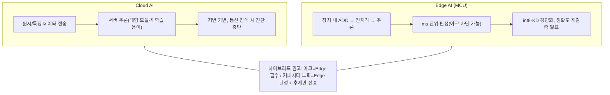

| 항목 | Cloud AI | Edge AI(MCU) | 근거 |
|---|---|---|---|
| 지연 | 네트워크 왕복으로 가변 | 장치 내 완결, STM32H7급 3–19 ms | [26][25][37] / Cloud: 일반적 공학 판단 |
| 통신 의존 | 단절 시 진단 중단, 100 kHz 원시 연속 전송은 비현실적 | 결과·이벤트만 전송, 오프라인 동작 | 일반적 공학 판단 |
| 연산·메모리 | 사실상 제약 없음 | KB–수백 KB, 양자화·KD 필요 | [28][29][35] |
| 정확도 | float32 그대로 | 양자화 후 재검증 필요 | [28][36] |
| 모델 갱신 | 즉시 교체 | OTA 체계 필요, TFLM은 모델 교체 유연 | [32] + 일반적 판단 |
| 비용 | 통신·서버 반복 비용 | MCU 단가 중심 | 일반적 판단 |

---

## 4. 주요 선행연구 분석

### Table 2. 핵심 선행논문 비교 (요약; 16개 항목 상세는 `03_paper_comparison_table.md`)

NC = 논문에서 확인되지 않음(초록 수준).

| # | 논문 | 등급 | 진단 대상 | 입력 | AI 모델 | 일반화 시험 | 실험/시뮬 | Edge |
|---|---|---|---|---|---|---|---|---|
| [1] | Zhao S. 외, TPEL 2021 | V1 | 리뷰 | — | 전 범주 | — | — | NC |
| [2] | Moradzadeh 외, TPEL 2022 | V1 | 고장진단 리뷰 | — | ANN/ML/DL | — | — | NC |
| [L1] | Park, Kim, Kwak, JPE 2022 (연구실) | V1 | 단상 C·ESR | v·i FFT(2f, fsw) | DNN | NC | 실험 | NC |
| [L2] | Park, Kwak, JEET 2023 (연구실) | V1 | 3상 C·ESR | 주파수 대역 | DNN/CNN/RNN/LSTM | NC | NC | NC |
| [5] | Örüklü, Ağalar, TIE | V2 | DC-link(AC/DC/AC) | 리플 기반 | ML | NC | NC | NC |
| [6] | Zhao S. 외, TPEL 2022 | V1 | 컨버터 파라미터 | NC | PIML | NC | NC | NC |
| [7] | Chen W. 외, TPEL 2020 | V1 | SiC MOSFET 예지 | 특성 추세 | 비지도 | NC | NC | online 목표 |
| [8] | Kahraman 외, Access 2024 | V1 | MOSFET SoH·RUL | 열화 궤적 | RF + BR | NC | 가속시험 20개 | NC |
| [10] | Liu Y. 외, APEC 2024 | V2 | IGBT 개방고장 | 전류 | 경량 CNN + TL | sim→HIL | 시뮬+HIL | NC |
| [12] | Li T. 외, Sensors 2025 | V1 | 컨버터 개방고장 | NC | conv-encoder + lifelong | 조건 순차 추가 | NC | NC |
| [14] | Lee S. K. 외, KBS 2024 | V2 | 전동기 고장 | 고정자 전류 | 자기지도 | 토크 조건 | NC | NC |
| [15] | Al-Kaf 외, TII 2026 | V2 | 3L-NPC 고장 | NC | CNN + Grad-CAM | NC | 시뮬+실험 | NC |
| [18] | Jiang R. 외, Sensors J. 2023 | V1 | AC series arc | 전류 | 1D-CNN | **미관측 부하 9종** | 학습: 모델 합성 | NC |
| [19] | Jiang R. 외, TII 2023 | V1 | series arc | coupling 특징 | ML | **단일→다중 부하** | 실험 | NC |
| [20] | Mao Y. 외, Access 2025 | V1 | DC series arc | NC | AI vs rule-based | 조건 적응성 | 문헌+실험 | 저자원 장치 |
| [21] | Sung Y. 외, Access 2022 | V1 | PV DC arc | 전류 | LSTM+1D-CNN, TL | NC | NC | SBC 실시간 |
| [25] | Paul K. C. 외, TPEL 2025 | V2 | PV DC arc + 차단 | NC | KD 경량 CNN | PV 운전 상황 | HW 프로토타입 | STM32H743 |
| [27] | Ma G. 외, TIE 2025 | V1 | ANPC 개방고장 | NC | Edge 2D-CNN | NC | NC | Edge(장치 NC) |

**분석.** [사실] 18편 중 random split 여부가 초록에서 확인된 논문은 없고, 운전조건(부하) split이 명시된 것은 [18][19]뿐이다. "같은 측정 파일의 window가 train/test에 섞였는가", "fault severity를 다뤘는가", "주파수·전압·스위칭 주파수까지 일반화되는가"는 대부분 NC였다. [해석] 선행연구의 높은 정확도 수치와 연구실 결과를 단순 비교하는 것은 근거가 약하며, 연구실이 **평가 프로토콜을 명시**하면 그 자체가 기여가 된다.

---

## 5. 연구실 연구주제와 AI 기술의 연계성

| 연구실 문제 | 적합한 AI 방법 | 근거 문헌 | 연계 방식 |
|---|---|---|---|
| 운전조건이 바뀌는 커패시터 노화진단 | LOCO 평가 + DG/DA + 물리 정규화 특징 | [11][13][14][6] | 운전조건을 domain으로 두고 정렬, 리플/상전류 정규화 |
| C·ESR 정량 추정 | 회귀 DNN/CNN, multi-task, PIML | [L1][L2][6] | 분류 코드와 회귀 계열 통합 |
| 라벨 부족 현장 | 정상 데이터 기반 이상탐지, 자기지도 | [14][17] | 설치 초기 정상 데이터로 기준 학습 |
| 모델이 무엇을 보는지 검증 | Grad-CAM, 대역 occlusion | [15][16] | fsw 대역(ESR) vs 스위칭 스파이크(장착 서명) |
| 부하 범용 아크 | 도메인 특징 + ML, 물리 모델 합성 + CNN | [18][19][20] | leave-one-load-out |
| MCU 탑재 | int8 PTQ/QAT, KD, TFLM, CMSIS-NN | [25][26][28][29][32][34] | 아크+커패시터 동시 상주 |
| 시뮬레이션 활용 | sim→실측 전이학습 | [10] | C/ESR 스윕 시뮬레이션 사전학습 |

---

## 6. 현재 개발 중인 AI 상태진단 코드 분석

대상: `…train80.py`(3,491행, 전체 구현)와 `…_____.py`(1,908행에서 잘린 부분 파일 — 실행 불가) [사실]. 상세는 `04_code_audit.md`.

**Figure 3. 현재 capacitor AI 코드 pipeline**

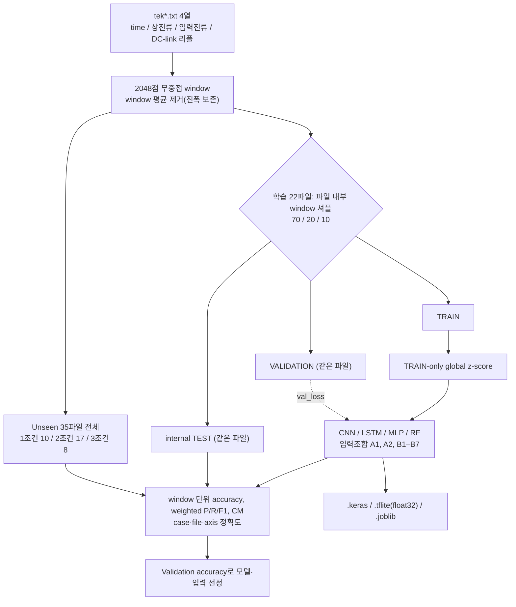

### 6.1 데이터
[사실] 학습 22파일(정상 11/노화 11)은 11개 운전점에서 정상 1 + 노화 1 쌍으로 구성된다. 학습 운전점은 f0 ∈ {30, 40, 60, 90} Hz, fsw ∈ {2, 4, 8, 14} kHz, V1 ∈ {50, 100, 135, 200} V(선간 실효값)이다. 부하 R축 파일은 R 값이 코드에 없다. 커패시터 개체 ID, C/ESR 값, 온도, Vdc, 토폴로지(2-level/3-level NPC), 리플 측정 지점은 코드에 기록이 없다 [미확인].

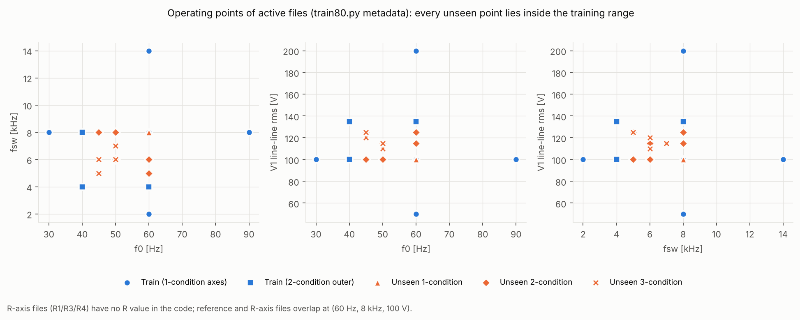
*Figure 7. 활성 파일의 운전점. 모든 미관측(unseen) 점이 학습 범위 안에 있다(원본 코드 메타데이터).*

### 6.2 입력
리플 전압이 필수 입력이고, A2는 상전류 파형, B1–B7은 운전조건 scalar(f0, fsw, V1)를 더한다. R/L은 모델 입력이 아니다 [사실].

### 6.3 Preprocessing
window 평균만 제거하고 LPF·리샘플링·window별 스케일링을 하지 않는다. 정규화는 TRAIN 전체의 스칼라 mean/std 한 쌍이라 window 간 **진폭 차이가 보존**된다 [사실].

### 6.4 모델
CNN(학습 파라미터 11,298, 수용영역 150 µs + GAP), LSTM(5,474, 앞단 AvgPool(4)로 12.5 kHz 이상 감쇠·alias), MLP(271,042, flatten), RF(200 trees, raw 2048점) [사실·계산].

### Table 3. AI 모델 CNN/LSTM/MLP/RF 비교

| 항목 | CNN | LSTM | MLP | RF |
|---|---|---|---|---|
| 학습 파라미터(A1) | 11,298 | 5,474 | 271,042 | 학습 window 수에 비례 |
| 연산량/window(추정) | ≈6.0 M MAC | ≈2.2 M MAC(순차 512 step) | ≈0.27 M MAC | 트리 깊이 × 200 |
| 입력 표현 적합성 | 이동 불변(GAP), 위상 비정렬 window에 적합 | 12.5 kHz 이상 대역 손실 | 위치 고정, 위상 변화에 약함 | 위치별 임계값, 주파수 구조 못 봄 |
| 진폭 의존 | 높음(진폭 보존 입력) | 높음 | 높음 | 높음 |
| 학습 설정 | Adam 1e-3, 15 epoch, ES(p=10), class_weight 없음 | 동일 | 동일 | balanced, validation 미사용 |
| Edge 적합성 | 높음(int8 약 12 KB 추정, TFLite 변환 확인) | 낮음(Flex op 필요) | 중간(float32 약 1.06 MB) | 낮음(TFLite 경로 없음) |
| 비교 공정성 | 설계상 유리 | 대역 손실로 불리 | 용량 과다·위치 의존 | raw 입력이라 불리 → 특징 기반 RF 필요 |

### 6.5 Training
EPOCHS=15, patience=10이라 조기종료는 사실상 발동하지 않는다. `restore_best_weights=True`는 Keras 3.15 소스에서 학습 종료 시 항상 복원됨을 확인했으나, 구버전 tf.keras에서는 다를 수 있어 실행 기록(`run_config.json`)의 버전 확인이 필요하다 [사실·미확인]. seed는 42 단일 실행이다.

### 6.6 Validation
VALIDATION은 학습 파일과 **같은 녹화**에서 무작위로 뽑은 20% window이며, 조기종료·학습률 조정·모델 선정에 쓰인다 [사실].

### 6.7 Unseen-condition test
1/2/3조건 unseen은 파일 단위로 분리되어 학습·선정에 쓰이지 않는다 [사실]. 그러나 모든 unseen 운전점이 학습 범위 내 **내삽**이고, reference·R3 파일의 scalar (60 Hz, 8 kHz, 100 V)는 학습 R축 파일과 같다. 2조건 case9는 노화 파일만 있다 [사실].

---

## 7. 코드 및 AI 실험 검증

### Table 4. 현재 코드 검증 결과

| 영역 | 항목 | 판정 | 근거(행) |
|---|---|---|---|
| 누수 | 같은 파일 window의 train/val/test 혼입 | **FAIL** (internal 지표 해석) | 2074–2127 |
| 누수 | 정규화 TRAIN-only | PASS | 2285–2346, 2974 |
| 누수 | Unseen의 선정·조기종료 사용 | PASS | 3005–3015, 3212–3227 |
| 누수 | test 결과를 보고 구성 변경 위험(주석 이력상 train↔test 역할 교환) | WARNING | 196–279, 530–776 |
| 누수 | scalar의 label proxy | PASS / 녹화·개체 교락 WARNING | 2514–2518 |
| 누수 | train∩test 파일 중복 | PASS / 탐지 한계 WARNING | 2824–2840 |
| 공정성 | 동일 split·정규화 | PASS | 2843–2984 |
| 공정성 | capacity·입력 표현·LSTM 대역 | WARNING | 2394–2745 |
| 공정성 | seed 반복 없음 | **FAIL** (순위 주장) | 2679–2684 |
| 일반화 | unseen = 범위 내 내삽, 외삽 미측정 | WARNING | 897–1422 |
| 평가 | window 단위 지표만, CI·유의성 없음 | **FAIL** (통계 주장) | 3033–3110 |
| 물리 | 진폭 보존 → 운전조건 진폭 효과·센서 이득에 노출 | WARNING | 2037, 2302–2304 |
| 물리 | 노화 vs 개체·장착 상태 구분 불가 | WARNING (데이터 설계) | 메타데이터 전반 |
| 구조 | 비교용 파일②가 1,908행에서 절단 | FAIL (실행 불가) | 파일② 1908 |
| Edge | TFLite float32, LSTM Flex op | RECOMMENDATION | 3162–3171 |

### 7.1 데이터 누수
internal VALIDATION/TEST는 같은 녹화의 인접 window다. 합성 실행에서 held-out window의 94%가 바로 옆 window를 TRAIN으로 가졌고, **라벨과 무관하고 파일 지문만 있는 합성 데이터에서 VALIDATION 96.8–100%, TEST 95.5%, Unseen 48–62%** 가 나왔다(Agent E). 따라서 internal 지표는 노화가 아니라 녹화 식별만으로도 높게 나올 수 있다.

### 7.2 Split 방식
학습 파일 내부 window 셔플 → 파일 단위 holdout(같은 운전점 반복 녹화: case1↔7, case3↔8, case5↔9), 조건쌍 LOCO, 측정 블록·개체 단위 분할로 확장해야 한다(04 문서 §10의 Exp 1–10).

### 7.3 Normalization
TRAIN-only로 올바르게 구현되었다(PASS). 다만 진폭이 보존되므로, 합성 데이터 시험에서 진폭 보존 CNN은 센서 이득 ±10–20%에 파일 정확도가 54–100% 범위로 흔들렸다(Figure 10). 실측 데이터에서도 이득 민감도 시험이 필요하다.

### 7.4 모델 비교 공정성
모델 간 학습 파라미터가 최대 약 50배 차이 나고, LSTM은 다른 대역을 보며, RF·MLP는 위상 비정렬 원파형에 불리하다. 합성 라벨 데이터에서 코드의 RF는 Validation 77%였으나 같은 split의 FFT 특징 RF는 100%였다(Agent E). 합성 실험에서는 internal TEST 순위(CNN 95.5 > RF 86.4)와 unseen 순위(RF 100 > CNN 85.7)가 뒤집혔다. **모델 순위는 입력 표현과 평가 프로토콜에 좌우된다.**

### 7.5 일반화 성능
현재 unseen은 내삽 시험이다. 합성 데이터의 조건쌍 LOCO에서는 CNN 68.2 ± 25.2%, RF 81.8 ± 25.2%로 떨어졌고 경계 조건 fold(V1 50/200 V 등)에서 50%였다. 실측 정확도는 [미확인]이므로, 연구실 데이터로 같은 시험을 해야 Q3에 답할 수 있다.

**Figure 9. 평가 프로토콜별 파일 단위 정확도(합성 데이터 — 메커니즘 예시)**

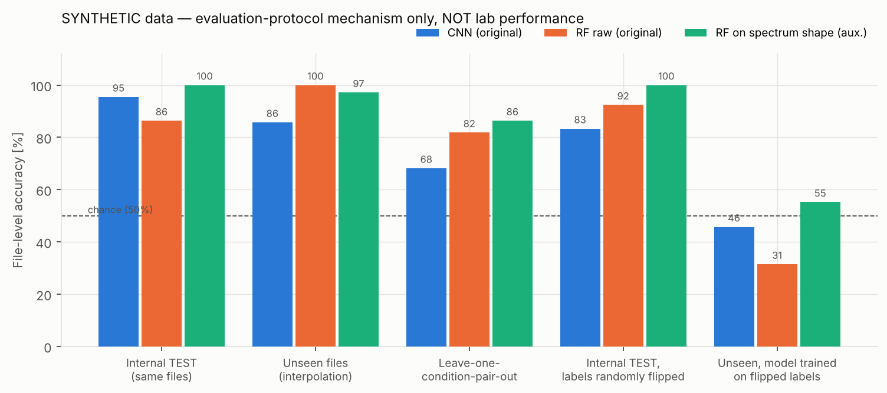

**Figure 10. 센서 이득 오차 민감도(합성 데이터)**

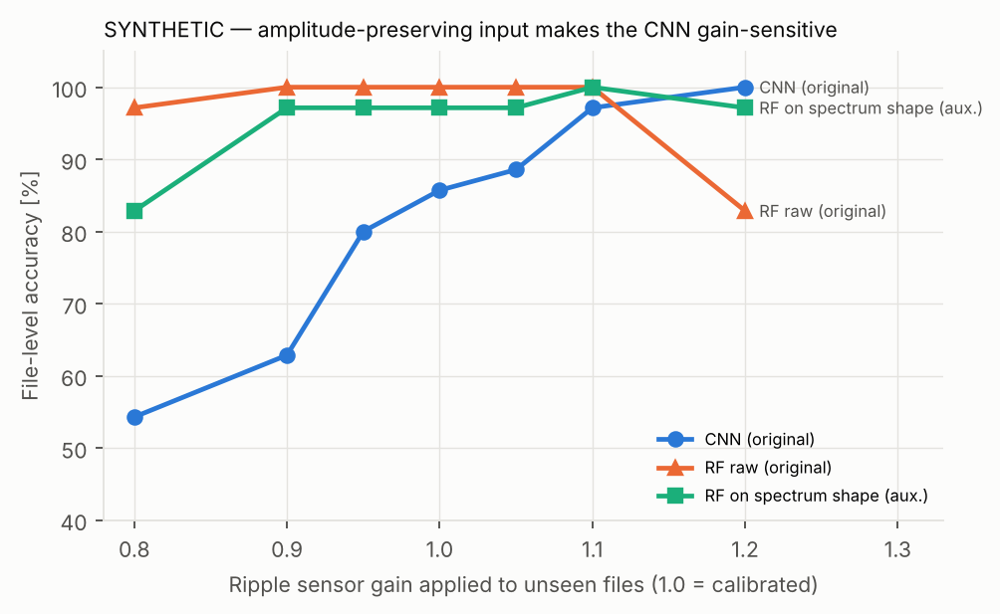

### 7.6 물리적 타당성
- [가정 기반 해석] 전해 커패시터 가정값(C=1000 µF, ESR=50 mΩ)에서 fsw 대역(4–14 kHz) 리플은 ESR이 지배하며, 노화(C −20%, ESR ×2) 시 |Z(8 kHz)|가 약 1.9배가 된다. 같은 가정에 문헌 근사식(원문 미확인)을 적용하면 V1 50→200 V에서 커패시터 전류 실효값이 약 5배 달라진다. **리플 진폭은 노화와 운전조건에 같은 크기로 반응한다.** 필름 커패시터라면 노화에 따른 리플 변화는 약 5%에 그친다. 커패시터 종류는 코드로 확인되지 않는다.
- [사실] 학습 운전점이 정상·노화 쌍으로 짝지어져 있어 운전조건이 라벨의 직접 지름길은 아니다.
- [추론] 그러나 측정 블록 안에서 라벨이 덩어리로 기록되었다(Figure 8). 3조건 테스트 8파일은 모두 outer TRAIN 3쌍과 같은 블록(tek0163–0182)에 있으며, 측정 순서(tek 번호) 1-NN만으로 3조건 라벨을 7/8(+동점 1) 맞힌다.

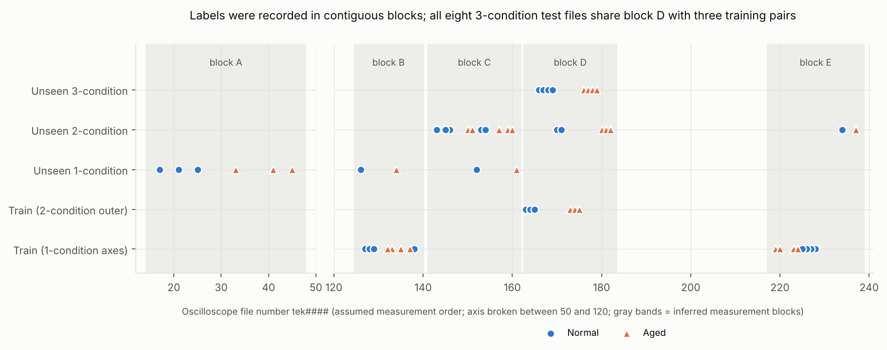
*Figure 8. tek 번호(측정 순서로 가정)와 라벨. 블록 구분은 번호 간격·라벨 전환에서 추론한 것이다.*

**Figure 4. 기존 신호처리 진단과 AI 기반 진단 비교**

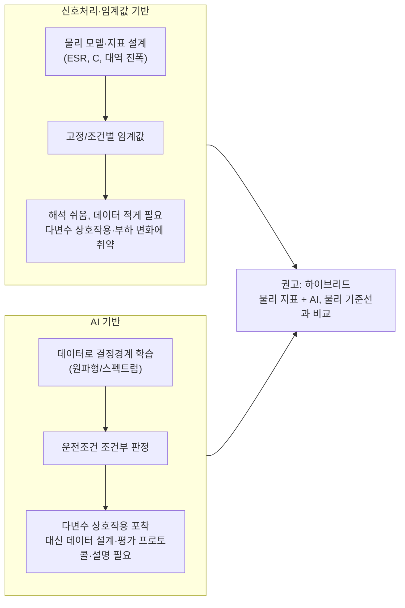

| 관점 | 신호처리·임계값 | AI 기반 | 근거 |
|---|---|---|---|
| 조건 변화 적응 | 임계값을 조건마다 다시 정해야 함 | 조건부 결정경계 학습 가능 | [20], 계획서 p.12 |
| 일반화 증거 | 물리 모델이 맞으면 외삽 가능 | 학습 분포 밖은 보장 없음 → 평가 필요 | [18][19], 04 §5 |
| 데이터 요구 | 적음 | 많음, 개체·조건 다양성 필수 | 04 §6 |
| 설명 | 지표 자체가 설명 | XAI·물리 기준선 비교 필요 | [15][16] |
| 성공 사례의 형태 | — | 물리 모델·도메인 특징과 결합한 하이브리드 | [18][19][20] |

---

## 8. 생성형 AI를 활용한 연구지원 사례

### 8.0 "AI 활용"의 두 관점

| 구분 | 정의 | 이 보고서의 예 |
|---|---|---|
| A. 연구 **대상**에 AI 적용 | 진단·예측 모델 자체가 연구 결과물 | CNN 기반 커패시터 노화진단, AI 아크 검출, RUL, Edge AI 진단 |
| B. 연구 **수행 과정**에 생성형 AI 활용 | 문헌 탐색·코드 검토·실험 자동화·문서화를 돕는 도구 | 본 보고서 작성 과정 전체(아래 Case Study) |

생성형 AI는 연구자의 판단을 대체하는 것이 아니라, **문헌 탐색·프로그래밍·반복 작업·검증을 지원하여 연구 효율을 높이는 도구**로 위치시킨다.

### Case Study: 생성형 AI를 활용한 전력전자 AI 상태진단 코드 검토

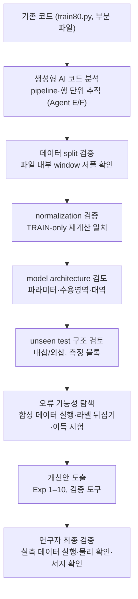

### 8.1 논문조사
5개 에이전트가 분야를 나눠 외부 후보 84편과 연구실 논문 29편을 탐색했다. 모든 논문에 검증 등급(V1/V2/X)을 붙였고, X 등급은 인용하지 않았다. **생성형 AI가 범할 수 있는 서지 오류를 실제로 발견**했다: 한 검색 요약은 다른 논문의 쪽수(CVPR 2018, pp. 2704–2713)를 2025년 논문에 섞어 표시했고, 같은 논문을 두 에이전트가 서로 다른 저자 수(2인/4인)로 기록했다. 교차검증으로 바로잡았다(06 문서 §6).

### 8.2 코드 분석
행 번호 단위로 pipeline을 추적해 split·정규화·선정 로직을 확인했고, 비교용 파일이 1,908행에서 잘린 부분 파일임을 확인했다.

### 8.3 코드 오류 검토
정적 분석만으로는 "확인 불가"였던 항목(예: `restore_best_weights`의 버전 의존 동작)을 실제 라이브러리 소스(Keras 3.15)로 확인했다. 원본 코드를 수정 없이 합성 데이터로 끝까지 실행해(TF 2.21, 4모델 × 3조합, 12/12 성공) 출력 구조와 TFLite 변환을 확인했다.

### 8.4 실험 설계 지원
Exp 1–10과 보조 실험 3종(라벨 뒤집기, 조건만/진폭+조건 기준선, 측정 순서 기준선)을 이 코드의 파일·운전점에 맞춰 구체화하고, 원본 함수를 재사용하는 검증 도구로 구현했다.

### 8.5 결과 분석 지원
합성 데이터로 평가 프로토콜의 메커니즘(Figure 9, 10)을 보였고, 메타데이터만으로 측정 블록 교락(Figure 8)과 내삽 구조(Figure 7)를 시각화했다.

### 8.6 한계 및 연구자 검증 필요성

| 생성형 AI가 한 일 | 반드시 연구자가 검증할 일 |
|---|---|
| 검색 스니펫 기반 서지 확인(V1/V2) | doi.org·원문으로 DOI·저자·내용 확인, 특히 V2와 "(초록)" 서술 |
| 코드 정적 분석·합성 데이터 실행 | **실측 데이터로 실행**(정확도, 파일별 window 수, 블록별 재집계) |
| 회로 가정값 기반 물리 해석 | 실제 토폴로지(2-level/NPC), 리플 측정 지점·coupling, 커패시터 종류·C/ESR·온도·Vdc |
| 측정 블록 추론(tek 번호 = 측정 순서 가정) | 실제 측정 일지와 커패시터 교체 이력 |
| 연구주제 점수(정성) | 연구실 자원·일정·산업체 과제 조건 반영 |

결론적으로, AI가 코드를 검토했다고 해서 코드가 옳다고 판단할 수 없다. **AI 검증 + 정적 코드 검토 + 실제 실행 결과 + 전력전자 물리적 검토**가 모두 있어야 하며, 이번 작업에서도 정적 분석이 "추정"으로 남긴 항목은 실행과 소스 확인으로, 실행이 답하지 못하는 항목(노화 vs 개체)은 물리 검토와 추가 측정 설계로 넘겼다.

---

## 9. 향후 AI 활용 가능 연구

후보 17개 주제의 평가는 `05_ai_research_opportunities.md`의 Table 5에 있다(척도 1–5, 데이터 확보난이도는 5=쉬움).

### Table 5. 향후 연구주제 후보 비교 (상위 발췌)

| 주제 | 연구실 적합성 | 신규성 | 실현가능성 | 데이터 확보난이도(5=쉬움) | 논문화 가능성 | Edge 적용 가능성 | 합계 |
|---|---:|---:|---:|---:|---:|---:|---:|
| 운전조건 강건 커패시터 진단 | 5 | 4 | 5 | 4 | 5 | 4 | 27 |
| AC/DC 아크 통합 진단 | 5 | 5 | 4 | 3 | 5 | 5 | 27 |
| 부하 변화 강인 아크 검출 | 5 | 4 | 4 | 4 | 5 | 5 | 27 |
| Edge/TinyML 실시간 커패시터 진단 | 5 | 4 | 4 | 4 | 4 | 5 | 26 |
| Physics-informed 열화 진단 | 5 | 5 | 3 | 3 | 5 | 4 | 25 |
| DA 기반 운전조건 일반화 | 5 | 4 | 4 | 4 | 4 | 4 | 25 |
| 정상 데이터 이상탐지 | 4 | 3 | 4 | 5 | 4 | 5 | 25 |
| XAI 주파수 대역 분석 | 4 | 4 | 5 | 5 | 4 | 3 | 25 |
| RUL 예측 | 3 | 3 | 2 | 1 | 3 | 3 | 15 |

### 9.1 단기 적용 (0–6개월)
① 기존 실측 결과를 파일·측정 블록 단위로 재집계(추가 측정 불필요) ② 검증 도구로 LOCO·라벨 뒤집기·진폭/이득 시험 ③ 쌍별 PSD·effect size 분석 ④ 커패시터 ID·C/ESR·온도·Vdc 메타데이터 기록 체계 ⑤ 아크 데이터 leave-one-load-out 재평가 ⑥ TFLite float vs int8 비교.

### 9.2 중기 연구 (6–18개월)
개체 다양화(정상·노화 각 ≥3, 노화 단계 ≥3), 물리 기반 특징·PIML, DA/DG, C·ESR multi-task, AC/DC 아크 통합 모델, KD·QAT와 아크+커패시터 동시 상주.

### 9.3 장기 연구 (18–36개월)
가속열화 궤적 기반 RUL, 현장 데이터 이상탐지·적응, 아크와 열화 상호작용 분석 기반 통합 진단, 현장 PoC 장시간 오경보율 검증.

**Figure 6. 향후 연구 roadmap**

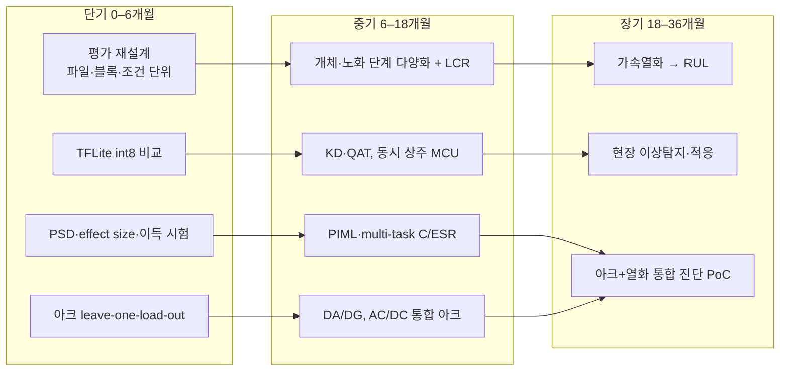

### 9.4 추천 연구주제 TOP 5
1. **운전조건 일반화가 검증된 DC-link 커패시터 노화진단** — 파일·블록·개체 단위 평가 프로토콜 + 물리 기반 정규화 특징 + XAI 대역 검증(G1, G2, G6).
2. **미관측 전력전자 부하에 강인한 아크 검출** — leave-one-load-out + 연구실 스위칭 성분 제거 기법[L8] + 도메인 정렬(G4).
3. **AC/DC 아크 통합 단일 모델** — 외부 연구가 AC·DC로 분리되어 있음(G4).
4. **MCU 온보드 커패시터 노화진단의 정량 검증** — int8·KD 후 미관측 조건 성능, 지연·메모리·오경보율(G3).
5. **Physics-informed multi-task C·ESR 추정 + 노화 분류** — 연구실의 회귀 계열[L1][L2]과 분류 계열 통합(G2).

---

## 10. 결론 — 핵심 연구 질문에 대한 답

**Q1. 전력전자 상태진단에 AI를 적용하는 것이 기존 신호처리/threshold 방식보다 실제로 어떤 장점을 가지는가?**
선행연구에서 확인된 장점은 운전조건이 바뀔 때의 **적응성**이다. [20]은 DC series arc에서 AI가 rule-based보다 조건 변화에 적응적이라고 결론지었고, [18][19]는 미관측 부하로의 일반화를 보였다. 다만 성공 사례는 모두 물리 모델·도메인 특징과 결합한 하이브리드다. 커패시터 진단에서 AI의 장점은 "진폭 기준선이 V1·부하·fsw에 따라 달라지는" 다변수 조건부 판정을 학습할 수 있다는 데 있다. 그러나 연구실 데이터에서 CNN이 **단순 기준선(진폭+운전조건 로지스틱, 물리 지표)보다 미관측 조건에서 더 나은지는 아직 보여지지 않았다.** 합성 데이터에서는 단순 진폭 기준선이 CNN과 같거나 더 좋았다. 장점은 "AI이기 때문"이 아니라 강한 기준선과의 비교로 입증해야 한다.

**Q2. 현재 연구실의 capacitor AI 진단 모델이 진짜 "노화 특성"을 학습하고 있는가, 운전조건을 학습하고 있는가?**
- 운전조건 자체를 라벨 대신 학습했을 가능성은 **낮다**[사실]: 학습 데이터가 같은 운전점의 정상·노화 쌍으로 짝지어져 있어 scalar 분포가 라벨별로 같다.
- 그러나 노화를 학습했다는 증거도 **현재로서는 없다**: internal 지표는 녹화 식별만으로 높게 나올 수 있고, 라벨은 측정 블록 안에서 커패시터 교체 이벤트와 겹치며, 커패시터 개체 수·C/ESR이 기록되어 있지 않다.
- 판별하려면 다른 커패시터 개체 시험(Exp 9), 같은 운전점 반복 녹화 비교, 블록별 재집계, 진폭 스케일링·대역 occlusion 분석이 필요하다.

**Q3. 새로운 switching frequency, fundamental frequency, voltage, load 조건에서도 모델이 동작하는가?**
[사실] 현재 코드는 학습 범위 **안**의 미학습 운전점(내삽)만 시험하며, 실측 정확도는 제공되지 않아 확인하지 못했다. 학습 범위 밖(fsw > 14 kHz, V1 > 200 V, f0 < 30 Hz 등)과 다른 부하 값은 시험되지 않았다. 합성 데이터의 LOCO에서는 경계 조건을 빼면 성능이 우연 수준까지 떨어지는 fold가 있었다. 경계값 fold를 포함한 LOCO와 블록 통제 시험이 필요하다.

**Q4. CNN/LSTM/MLP/RF 중 어떤 모델이 좋은지가 중요한가, 아니면 입력 신호와 학습 데이터 설계가 더 중요한가?**
현재 단계에서는 **입력 표현·데이터 설계·평가 프로토콜이 더 중요하다**. 근거: ① 연구실 선행 논문[L2]에서 입력 대역에 따라 최적 모델이 바뀌었다. ② 같은 split에서 RF의 입력을 원파형에서 FFT 특징으로 바꾸자 77% → 100%가 되었다(합성). ③ 합성 실험에서 internal TEST 기준과 unseen 기준의 모델 순위가 뒤집혔다. ④ 모델 간 파라미터 수가 최대 약 50배 다르고 seed 반복이 없다. 모델 비교는 이 조건들을 고정한 뒤에 의미가 있다.

**Q5. 실험실 모델을 실제 MCU 기반 Edge AI로 옮기기 위해 무엇을 추가 검증해야 하는가?**
① float32 Keras / float TFLite / int8 TFLite를 같은 test set(파일 단위, 미관측 조건 포함)으로 비교하고 혼동행렬 확인[28][36] ② 모든 운전조건을 덮는 calibration 데이터 ③ window 평균 제거·전역 z-score 상수(`preprocessor.npz`)를 펌웨어에서 같게 재현했는지 고정 test vector로 확인 ④ 진폭 보존 모델이므로 **ADC·센서 이득 오차 민감도**(합성 시험에서 ±10–20% 이득에 정확도 급변) ⑤ 20.48 ms window 대비 전처리+추론 지연(STM32H7급 문헌값 3–19 ms[26][37]) ⑥ RAM/Flash와 아크 모델 동시 상주 ⑦ LSTM은 Flex op 의존이라 TFLite Micro 탑재가 어려움 → CNN 계열 권장 ⑧ 연속 N회 확인·히스테리시스 판정 로직과 장시간 오경보율([25]: 5-cycle 확인으로 19 → 95 ms) ⑨ 온도에 따른 ESR 변화 분리.

**Q6. 현재 연구실 기술을 기반으로 논문화 가능성이 가장 높은 AI 연구주제는 무엇인가?**
① 운전조건 일반화가 검증된 DC-link 커패시터 노화진단(평가 프로토콜 + 물리 정규화 + XAI) — 데이터·코드 기반이 이미 있고, 다축 운전조건·외삽·개체 일반화를 명시한 연구가 이번 범위에서 확인되지 않았다. ② 미관측 전력전자 부하에 강인한 아크 검출 — 연구실의 아크 데이터·시험환경이 강점이고, 외부에서 미관측 부하를 명시 평가한 V1 연구는 AC series 2편뿐이었다.

**Q7. 생성형 AI를 연구 과정에서 어디까지 활용할 수 있으며, 어떤 부분은 반드시 연구자가 검증해야 하는가?**
활용 범위: 문헌 후보 탐색과 서지 1차 검증, 코드 pipeline 추적과 누수 탐지, 합성 데이터 기반 실행 검증, 실험 설계 구체화, 검증 도구 구현, 시각화, 문서 초안. 반드시 연구자가 할 일: 원문·DOI 확인, 실측 데이터 실행과 결과 해석, 회로·측정 조건(토폴로지, 측정 지점, 커패시터 종류, 온도)의 사실 확인, 연구 질문과 결론의 최종 판단. 이번 작업에서도 생성형 AI의 검색 요약에 서지 오류가 섞여 있었고, 정적 분석은 라이브러리 버전 의존 동작을 확정하지 못해 실행·소스 확인이 필요했다.

---

## 참고문헌

검증 등급과 근거 URL은 `06_reference_verification.md` 참조. V2는 DOI 미확인, P는 이전 조사 기록(이번 세션 미재검증).

[1] S. Zhao, F. Blaabjerg, H. Wang, "An Overview of Artificial Intelligence Applications for Power Electronics," *IEEE Trans. Power Electron.*, vol. 36, no. 4, pp. 4633–4658, 2021. doi:10.1109/TPEL.2020.3024914
[2] A. Moradzadeh, B. Mohammadi-Ivatloo, K. Pourhossein, A. Anvari-Moghaddam, "Data Mining Applications to Fault Diagnosis in Power Electronic Systems: A Systematic Review," *IEEE Trans. Power Electron.*, vol. 37, no. 5, pp. 6026–6050, 2022. doi:10.1109/TPEL.2021.3131293
[3] H. Wang, F. Blaabjerg, "Reliability of Capacitors for DC-Link Applications in Power Electronic Converters—An Overview," *IEEE Trans. Ind. Appl.*, vol. 50, no. 5, 2014. doi:10.1109/TIA.2014.2308357 (P)
[4] Z. Zhao, P. Davari, W. Lu, H. Wang, F. Blaabjerg, "An Overview of Condition Monitoring Techniques for Capacitors in DC-Link Applications," *IEEE Trans. Power Electron.*, vol. 36, no. 4, 2021. doi:10.1109/TPEL.2020.3023469 (P)
[5] K. Örüklü, Ş. Ağalar, "Machine learning-based condition monitoring for dc-link capacitors in ac/dc/ac converters," *IEEE Trans. Ind. Electron.*, vol. 72, no. 4, pp. 4227–4237. (V2)
[6] S. Zhao, Y. Peng, Y. Zhang, H. Wang, "Parameter Estimation of Power Electronic Converters With Physics-Informed Machine Learning," *IEEE Trans. Power Electron.*, vol. 37, no. 10, pp. 11567–11578, 2022. doi:10.1109/TPEL.2022.3176468
[7] W. Chen, L. Zhang, K. Pattipati, A. M. Bazzi, S. Joshi, E. M. Dede, "Data-Driven Approach for Fault Prognosis of SiC MOSFETs," *IEEE Trans. Power Electron.*, vol. 35, no. 4, 2020. doi:10.1109/TPEL.2019.2936850
[8] C. L. Kahraman, D. Roman, L. Kirschbaum, D. Flynn, J. Swingler, "Machine Learning Pipeline for Power Electronics State of Health Assessment and Remaining Useful Life Prediction," *IEEE Access*, vol. 12, pp. 136727–136746, 2024. doi:10.1109/ACCESS.2024.3460177
[9] T. Mamee et al., "Estimating of IGBT Bond Wire Lift-Off Trend Using Convolutional Neural Network (CNN)," *IEEE Access*, vol. 12, pp. 96936–96945, 2024. (V2)
[10] Y. Liu, A. Sangwongwanich, Y. Zhang, S. Ou, H. Wang, "A Transferable Deep Learning Network for IGBT Open-circuit Fault Diagnosis in Three-phase Inverters," *IEEE APEC*, 2024. (V2)
[11] J. Zhu, Y. Wang, H. Yan, S. Lu, W. Li, "A New Weighted Mechanism-Based Partial Transfer Fault Diagnosis Method for Voltage Source Inverter," *IEEE Trans. Transp. Electrific.*, vol. 11, no. 3, pp. 7588–7598, 2025. (V2)
[12] T. Li, E. Wang, J. Yang, "Lifelong Learning-Enabled Fractional Order-Convolutional Encoder Model for Open-Circuit Fault Diagnosis of Power Converters Under Multi-Conditions," *Sensors*, vol. 25, no. 6, 1884, 2025. doi:10.3390/s25061884
[13] Y. Ganin et al., "Domain-Adversarial Training of Neural Networks," *J. Mach. Learn. Res.*, vol. 17, no. 59, pp. 1–35, 2016. arXiv:1505.07818 (V2)
[14] S. K. Lee, H. Kim, M. Chae, H. J. Oh, H. Yoon, B. D. Youn, "Self-supervised feature learning for motor fault diagnosis under various torque conditions," *Knowledge-Based Systems*, 2024. (V2)
[15] H. A. G. Al-Kaf, S. S. Hakami, K.-B. Lee, "Explainable Deep Learning Fault Detection Method for Multilevel Inverters," *IEEE Trans. Ind. Informat.*, vol. 22, no. 1, pp. 579–590, 2026. (V2)
[16] R. Machlev et al., "Explainable Artificial Intelligence (XAI) techniques for energy and power systems: Review, challenges and opportunities," *Energy and AI*, vol. 9, 100169, 2022. doi:10.1016/j.egyai.2022.100169
[17] Q. Luo, J. Chen, Y. Zi, J. Xie, "A synchronization-induced cross-modal contrastive learning strategy for fault diagnosis of electromechanical systems under semi-supervised learning with current signal," *Expert Syst. Appl.*, vol. 249, 123801, 2024. (V2)
[18] R. Jiang, Y. Wang, X. Gao, G. Bao, Q. Hong, C. Booth, "AC series arc fault detection based on RLC arc model and convolutional neural network," *IEEE Sensors J.*, vol. 23, no. 13, pp. 14618–14627, 2023. doi:10.1109/JSEN.2023.3280009
[19] R. Jiang, G. Bao, Q. Hong, C. Booth, "Machine learning approach to detect arc faults based on regular coupling features," *IEEE Trans. Ind. Informat.*, vol. 19, no. 3, pp. 2761–2771, 2023. doi:10.1109/TII.2022.3153333
[20] Y. Mao, S. Safa, G. Smith, L. Wurth, R. Weiss, J. Hagemeyer, "Why AI: A Comparative Study for Detection Methods in DC Series Arc Fault," *IEEE Access*, 2025. doi:10.1109/ACCESS.2025.3548309
[21] Y. Sung, G. Yoon, J.-H. Bae, S. Chae, "TL–LEDarcNet: Transfer Learning Method for Low-Energy Series DC Arc-Fault Detection in Photovoltaic Systems," *IEEE Access*, vol. 10, pp. 100725–100735, 2022. doi:10.1109/ACCESS.2022.3208115
[22] Y. Wang, L. Hou, K. C. Paul, Y. Ban, C. Chen, T. Zhao, "ArcNet: Series AC Arc Fault Detection Based on Raw Current and Convolutional Neural Network," *IEEE Trans. Ind. Informat.*, vol. 18, no. 1, pp. 77–86, 2022. (V2)
[23] Choi et al., "Series-arc-fault diagnosis using feature fusion-based deep learning model," *ETRI J.*, vol. 46, no. 6, pp. 1061–1074, 2024. doi:10.4218/etrij.2023-0457 (저자 일부 미확인)
[24] K. C. Paul et al., "Artificial Intelligence for DC Arc Fault Detection in Photovoltaic Systems," *IEEE Access*, 2025. doi:10.1109/ACCESS.2025.3572521 (저자 일부 미확인)
[25] K. C. Paul, J. Zhou, S.-E. Chen, T. Zhao, "PV Arc Fault Circuit Interrupter with Knowledge Distillation-Based Lightweight Convolutional Neural Network and SSCB Integration," *IEEE Trans. Power Electron.*, vol. 40, no. 12, pp. 18189–18201, 2025. (V2)
[26] K. C. Paul, C. Chen, Y. Wang, T. Zhao, "LArcNet: Lightweight Neural Network for Real-Time Series AC Arc Fault Detection," *IEEE Open J. Ind. Appl.*, vol. 6, pp. 79–92, 2025. (V2)
[27] G. Ma, C. Yao, S. Xu, G. Ren, Z. Sun, S. Wu, "Real-Time Diagnosis of Multiple Open-Circuit Faults in ANPC Inverters Based on Lightweight Deployment of Edge 2D-CNN," *IEEE Trans. Ind. Electron.*, 2025 (early access). doi:10.1109/TIE.2025.3549086
[28] B. Jacob et al., "Quantization and Training of Neural Networks for Efficient Integer-Arithmetic-Only Inference," *Proc. IEEE/CVF CVPR*, pp. 2704–2713, 2018. doi:10.1109/CVPR.2018.00286
[29] G. Hinton, O. Vinyals, J. Dean, "Distilling the Knowledge in a Neural Network," arXiv:1503.02531, 2015.
[30] S. Han, H. Mao, W. J. Dally, "Deep Compression: Compressing Deep Neural Networks with Pruning, Trained Quantization and Huffman Coding," *ICLR*, 2016. arXiv:1510.00149
[31] S. Han, J. Pool, J. Tran, W. J. Dally, "Learning both Weights and Connections for Efficient Neural Networks," *NeurIPS*, 2015. arXiv:1506.02626
[32] R. David et al., "TensorFlow Lite Micro: Embedded Machine Learning for TinyML Systems," *Proc. MLSys*, 2021. arXiv:2010.08678
[33] C. Banbury et al., "MLPerf Tiny Benchmark," *NeurIPS Datasets and Benchmarks Track*, 2021. arXiv:2106.07597
[34] L. Lai, N. Suda, V. Chandra, "CMSIS-NN: Efficient Neural Network Kernels for Arm Cortex-M CPUs," arXiv:1801.06601, 2018.
[35] S. S. Saha, S. S. Sandha, M. Srivastava, "Machine Learning for Microcontroller-Class Hardware: A Review," *IEEE Sensors J.*, vol. 22, no. 22, pp. 21362–21390, 2022. doi:10.1109/JSEN.2022.3210773
[36] P.-E. Novac, G. Boukli Hacene, A. Pegatoquet, B. Miramond, V. Gripon, "Quantization and Deployment of Deep Neural Networks on Microcontrollers," *Sensors*, vol. 21, 2984, 2021. arXiv:2105.13331
[37] W. Liao, "Real Time Bearing Fault Diagnosis Based on Convolutional Neural Network and STM32 Microcontroller," arXiv:2304.09100, 2023.

**연구실 논문**
[L1] H.-J. Park, J.-C. Kim, S. Kwak, *J. Power Electron.*, vol. 22, no. 3, pp. 513–521, 2022. doi:10.1007/s43236-021-00366-x
[L2] H.-J. Park, S. Kwak, *J. Electr. Eng. Technol.*, vol. 18, no. 3, pp. 1841–1850, 2023. doi:10.1007/s42835-023-01424-z
[L3] H.-L. Dang, H.-J. Park, S. Kwak, S. Choi, *J. Electr. Eng. Technol.*, vol. 18, no. 4, pp. 3021–3032, 2023. doi:10.1007/s42835-023-01426-x
[L4] H.-L. Dang, S. Kwak, *Sensors*, vol. 20, no. 13, 3740, 2020. doi:10.3390/s20133740
[L5] H.-L. Dang, J. Kim, S. Kwak, S. Choi, *IEEE Access*, vol. 9, pp. 133346–133364, 2021. doi:10.1109/ACCESS.2021.3115512
[L6] J.-Y. Jeong, J.-C. Kim, S. Kwak, *J. Power Electron.*, vol. 21, no. 12, pp. 1900–1909, 2021. doi:10.1007/s43236-021-00332-7
[L7] H.-L. Dang, S. Kwak, S. Choi, *IEEE Access*, vol. 10, pp. 76386–76400, 2022. doi:10.1109/ACCESS.2022.3192517
[L8] H.-L. Dang, S. Kwak, S. Choi, *IEEE Access*, vol. 11, pp. 119584–119595, 2023. doi:10.1109/ACCESS.2023.3327465
[L9] H.-L. Dang, S. Kwak, S. Choi, *IEEE Access*, vol. 12, pp. 56062–56076, 2024. doi:10.1109/ACCESS.2024.3389031
[L10] J.-Y. Jeong, S. Kwak, *J. Electr. Eng. Technol.*, vol. 18, no. 4, pp. 3049–3059, 2023. doi:10.1007/s42835-023-01537-5
[L11] J. Kim, S. Kwak, S. Choi, *Machines*, vol. 10, no. 12, 2022. (V2)
(연구실 논문의 전체 제목은 `06_reference_verification.md` §3)
