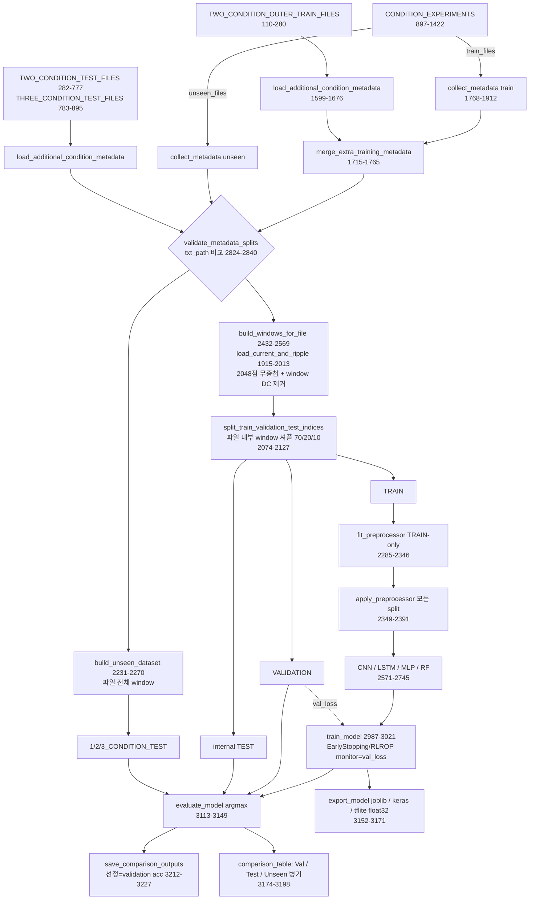

# Agent E — Code Audit: train80.py (커패시터 정상/노화 window 분류 비교 코드)

- 대상 1 (train80.py): `/root/.claude/uploads/62852d7e-33e5-516a-8a9d-1c4b8909ce11/785d26be-_____train80.py` (3491행, LF, sha256 `f0e142e2…9f0b`)
- 대상 2 (file2): `/root/.claude/uploads/62852d7e-33e5-516a-8a9d-1c4b8909ce11/b81deba1-_____.py` (1908행, CRLF, sha256 `b987143b…f22a`)
- 원본은 수정하지 않음. 모든 실행은 scratchpad 복사본(`scratchpad/agentE/src/*.py`, sha256 동일 확인)으로 수행.
- 표기: **확인** = 코드/실행 결과에서 직접 확인, **추정** = 확인하지 못한 해석/추론, **정적 분석만** = 실행 불가(TensorFlow 미설치)

---

## 0. 요약 (핵심 발견)

1. **[FAIL] 내부 VALIDATION/TEST 는 같은 파일의 인접 window**: 학습조건 파일 22개 모두 window 단위 랜덤 셔플로 70/20/10 분할(2096–2119행). 경계 gap 이 없고 연속 window 이다. 합성 실행에서 22/22 파일이 3개 split 에 동시에 들어갔고, held-out window 의 94.0%(79/84)가 바로 옆 window 가 TRAIN 이었다. **라벨과 무관한 합성 데이터**(파일 지문만 있음)에서 이 split 그대로 쓰면 Validation 96.8–100%, Test 95.5% 가 나왔다. Unseen 은 48–62% 였다(보조 실험, 3 seed). → Validation/Test 정확도는 "노화 판별"이 아니라 "파일 식별"로 부풀 수 있다.
2. **[PASS] 정규화는 TRAIN-only**: `preprocessor.npz` 의 wave_std(1.155856)가 TRAIN window 로 독립 재계산한 값과 일치했다. TRAIN+VAL+TEST(1.154876)나 전체(1.118241)와는 다르다. 제어 scalar 의 mean/std 도 TRAIN-only 값과 일치했다(확인). per-window 전처리는 DC(평균)만 제거하고 진폭은 보존한다(2036–2037행).
3. **[PASS] Unseen 은 early stopping·자동 선정·threshold 에 쓰이지 않는다** (3005–3015, 3212–3227, 3125행). **[WARNING]** 다만 비교표(3175–3196행)와 콘솔이 Validation·Test·Unseen 을 나란히 보여 준다. 주석 이력상 2조건 파일 12개는 test↔outer-train 역할이 서로 바뀌었다(확인). 따라서 사람이 test 결과를 보고 설계를 조정했을 위험이 있다(추정).
4. **[PASS] 활성 목록에서 train ∩ test file_key = ∅** (train80, file2 모두. ast 로 리터럴만 추출). `validate_metadata_splits` 는 file_uid 가 아니라 소문자화한 `txt_path` 를 비교한다. 그래서 condition_axis 접두사가 탐지를 무력화하지 않는다(실증 C1). **[WARNING]** 경로 기반이라 다른 폴더의 같은 tek 번호나, 이름만 다르고 내용이 같은 파일은 탐지하지 못한다(실증 C5, C6).
5. **[PASS/WARNING] 운전조건 scalar 는 label proxy 가 아님**: 학습 데이터의 10개 (f0, fsw, V1) 조건 모두 정상:노화 = 1:1(파일 수)이다(확인). 다만 조건마다 정상 1파일·노화 1파일뿐이라 "파일(녹화 세션) 정체성 = label" 이 완전 교락된다. 1조건 unseen 4개 파일(tek0017/0041/0025/0033)의 scalar 는 학습 조건 (60, 8000, 100) 과 같다(확인).
6. 구현 리스크는 다음과 같다.
   - fs 불일치는 경고만 출력하고 그대로 포함한다(실증).
   - EPOCHS=15, patience=10 이라 early stopping 은 사실상 발동하지 않는다.
   - `restore_best_weights` 동작은 Keras 버전에 따라 다르다(추정).
   - LSTM 의 AvgPool(4) 때문에 14 kHz 성분이 11 kHz 로 alias 된다.
   - RF/MLP 는 원시 시계열을 flatten 해서 입력한다(위상 불변성 없음).
   - case_id 짝이 맞지 않는다(`v_4_normal`/`v_3_aged`).
   - 파일 단위 다수결 집계가 없다.
   - TFLite 는 양자화하지 않는다.
7. **file2 는 실행할 수 없는 부분 파일이다**: `collect_metadata` 중간인 1908행에서 끝난다. 10개 metadata 함수와 상수만 있고, 신호 로딩·window·분할·모델·학습·평가·`main` 이 없다(확인).

---

## 1. file2 (b81deba1-_____.py) 확인 결과

| 항목 | 결과 | 근거 |
|---|---|---|
| train80.py 1–1908행과의 차이 | 경로 문자열(73, 88, 108, 781, 905–906, 1045–1046, 1187–1188, 1289–1290행: `D:\Users\<user>\...\데이터 모음`), **tek0172 활성**(476–488행), 1908행 | `diff --strip-trailing-cr` (확인) |
| 1908행 | train80: `"같은 TXT 경로가 중복 등록되어 있습니다.\n"` 다음에 f-string 이 이어짐. file2: `"같은 TXT 경로가 중복 등록되어 있습니다")` 로 바로 닫히고 파일 끝(EOF, 개행 없음) | 확인 |
| 구문 | `ast.parse` 성공. 정의된 함수는 `map_label_to_binary` ~ `collect_metadata` 의 10개뿐. `collect_metadata` 에 `return` 이 없어 None 을 반환함. `if __name__ == "__main__"` 없음 | 확인 |
| 없는 코드 | `load_current_and_ripple`, `preprocess_*`, `build_windows_for_file`, `split_train_validation_test_indices`, dataset 빌더, `fit/apply_preprocessor`, 모든 모델, `train_model`, `evaluate_model`, `run_comparison`, `main` | 확인 |
| 영향 | 실행해도 상수와 함수 정의만 하고 끝난다. 학습/평가 결과를 만들 수 없다. 활성 목록은 tek0172 가 추가되어 2조건 test 18개(정상 9/노화 9)이며, case9 가 정상/노화 짝을 갖는다 | 확인 |

---

## 2. Pipeline 추적 (train80.py)

### 2.1 단계별 표

| # | 단계 | 함수 (행) | 입력 → 출력 (shape) | 비고 |
|---|---|---|---|---|
| 0 | CLI/설정 검증 | `main` (3427–3487) | argv → root 폴더, `run_config.json` | `--data-root` 가 모든 data dir 을 덮어씀(3463–3467). `--check-data` 는 shared data 까지만 만듦(3480–3482). TF 가 없으면 RF 외 모델은 ImportError(3444–3445) |
| 1 | metadata (1조건) | `collect_metadata` (1768–1912) → `load_metadata` (1535–1596) | `CONDITION_EXPERIMENTS[axis]['train_files'/'unseen_files']` → DataFrame(file_key, label 0/1, f0, fsw, V1, txt_path, **file_uid=`{axis}::{file_key}`**(1586)) | 축 내부 file_uid 중복 시 오류(1591–1594). 축 간 같은 txt_path 는 train 이면 metadata 가 같을 때 dedup, 충돌하면 오류. unseen 이면 오류(1836–1910) |
| 2 | metadata (2/3조건) | `load_additional_condition_metadata` (1599–1676), `load_two_condition_*`, `load_three_condition_test_metadata` (1679–1712) | 리스트 → DataFrame (+test_group, changed_conditions, R, L) | R/L 은 기록용이며 모델 입력이 아님(확인: 2514–2518 의 control_vector 는 f0, fsw, V1 만) |
| 3 | train 병합 | `merge_extra_training_metadata` (1715–1765) | 1조건 train + 2조건 outer train → train_meta | 경로 기준 dedup |
| 4 | 분할 검증 | `validate_metadata_splits` (2824–2840) | train_meta, {1/2/3_CONDITION_TEST} → 오류 또는 통과 | **소문자 txt_path 비교**(2825, 2830). 각 test 내부 중복, train∩test, test 그룹 간 중복을 검사하고 train 에 0/1 이 모두 있는지 확인 |
| 5 | 신호 로딩 | `load_current_and_ripple` (1915–2013) | TXT(4열: time, load current, inverter input current, ripple V) → `(t[N], i_load[N], i_in[N], v_ripple[N], fs_measured)` float64 | `np.loadtxt` 가 실패하면 regex fallback(1930–1969). 비유한값 행 제거, 시간 정렬, **중복 시간 제거**(1983–1986). fs 는 median dt 로 구하고 허용오차를 넘으면 **print 만** 함(1999–2005) |
| 6 | window 분할 | `build_windows_for_file` (2432–2569) | meta → `X_wave (W,2048,1)`, `X_current (W,2048,1)`, `X_input_current (W,2048,1)`, `X_control (W,3)=[f0,fsw,V1]`, `y (W,)`, feature_df | 시작점 `arange(0, N-2048+1, 2048)`(2466–2471), 남는 끝 샘플은 버림. W<2 이면 오류(2474) |
| 7 | per-window 전처리 | `preprocess_ripple_window` (2024–2038), `preprocess_phase_current_window` (2041–2053), `preprocess_inverter_input_current_window` (2056–2071) | (2048,) → (2048,) float32 | ripple/상전류는 **window 평균만 제거**. 진폭은 유지. 입력전류는 DC 를 유지(`INVERTER_INPUT_CURRENT_REMOVE_DC=False`)하고 모델 입력에서는 제외 |
| 8 | 파일 내부 분할 | `split_train_validation_test_indices` (2074–2127) | n_windows, file_uid → train/val/test index | `rng=default_rng(42 + tek번호)`(2090–2097)로 **window 를 셔플**해 70/20/10. TEST 가 나머지를 가져감. n<3 이면 오류 |
| 9 | 학습조건 dataset | `build_train_validation_test_dataset` (2130–2228) | train_meta → {TRAIN, VALIDATION, TEST}: X_*_raw, y, files(file_uid), conditions, condition_axes | 파일마다 3개 split 에 모두 들어감 |
| 10 | unseen dataset | `build_unseen_dataset` (2231–2270) | test meta → 같은 구조(파일의 모든 window) | 1/2/3_CONDITION_TEST 각각 |
| 11 | shared data | `prepare_shared_data` (2843–2970) + `attach_window_manifest` (2784–2821) | → `datasets` 6개 split, `window_manifest.csv`, `dataset_info.json`, fingerprint | 같은 split 함수를 다시 호출해 manifest 를 재구성하고 순서를 검증(2811–2816). sample_id 교집합을 검사(2882–2891). 원시 배열은 읽기 전용(2963–2966) |
| 12 | 입력 조합 | `activate_combination` (2671–2676), `INPUT_COMBINATIONS` (1467–1477) | A1, A2, B1–B7 → `INPUT_PARAMETER_SELECTION` | ripple 은 항상 포함. B 계열은 scalar(f0/fsw/V1)를 추가 |
| 13 | 정규화 | `normalize_combination` (2973–2984) → `fit_preprocessor` (2285–2346), `apply_preprocessor` (2349–2391) | TRAIN raw → mean/std: wave (1,1,1), current (1,1,1), control (1,k). 모든 split 에 적용 → `X_wave (N,2048,1)`, `X_control (N,k)` | **TRAIN 만으로 fit**(2974). 단일 scalar global z-score 라 window 사이 상대 진폭이 보존됨 |
| 14a | CNN | `build_condition_aware_cnn` (2571–2667), `_build_waveform_cnn_branch` (2394–2408) | (2048,1) → Conv16 k7 → Conv32 k5 s2 → Conv64 k3 s2 → GAP(64). scalar 가 있으면 Dense16 을 concat. Dense32 → Dropout 0.3 → Dense2 softmax | 정적 분석만 |
| 14b | LSTM/MLP | `build_keras_model` (2695–2737) | LSTM: AvgPool1D(4) → (512,1) → LSTM32 → Dense32 → Dropout → Dense2. MLP: Flatten 2048 → [Dense128, BN, LReLU, Drop] → [Dense64 …] → (scalar/다중 branch 일 때만 Dense32) → Dense2 | 정적 분석만 |
| 14c | RF | `train_model` (2992–3001), `get_rf_inputs` (2740–2745) | (N, 2048·n_wave + k) flatten → RF(200, sqrt, balanced, rs=42) | 실행 확인 |
| 15 | 학습 | `train_model` (2987–3021) | Adam(1e-3), sparse CE, EPOCHS=15, BATCH=32. `EarlyStopping(val_loss, patience=10, restore_best_weights=True)`, `ReduceLROnPlateau(val_loss, 0.5, patience=4)`. validation_data=VALIDATION | **monitor 는 VALIDATION 의 val_loss**. Keras 에는 class_weight 없음 |
| 16 | 예측/채점 | `predict_probabilities` (3024–3030), `evaluate_model` (3113–3149), `score_predictions` (3033–3110) | (N,2) 확률 → **argmax**(3125) → accuracy, weighted P/R/F1, CM, classification_report, case/file/axis accuracy | TOTAL_TEST = 1+2+3조건 unseen 을 합친 것(3136–3147). 파일 다수결은 없음 |
| 17 | 비교/선정 | `run_comparison` (3305–3424), `save_comparison_outputs` (3201–3292), `format_comparison_table` (3174–3198) | rows → `comparison_summary.csv/xlsx`, `best_input_per_model_by_validation.csv` | **선정 기준: validation_accuracy 내림차순, 동률이면 input_count, 그다음 combination_id**(3216–3221) |
| 18 | 내보내기 | `export_model` (3152–3171) | RF 는 `model.joblib`. Keras 는 `model.keras` + `model.tflite` | TFLite 에 `converter.optimizations` 설정이 없어 **양자화하지 않음(float32)**. LSTM 은 SELECT_TF_OPS 사용 |

### 2.2 Mermaid flowchart



---

## 3. 데이터 누수 검증

| # | 항목 | 판정 | 근거 행 | 설명 |
|---|---|---|---|---|
| 1 | 동일 원본 파일의 window 가 train/validation/test 에 동시에 들어가는가 | **FAIL** (내부 VALIDATION/TEST 기준) | 2074–2127, 2146–2186, 2466–2471 | **확인**: 분할 단위는 파일 내부 window 이고, 연속 블록이 아니라 `rng.permutation` 셔플이며 경계 gap 이 없다(stride=len=2048). 실행 결과: 22/22 파일이 3개 split 에 모두 있었다. `max_gap_samples=0`. VALIDATION+TEST window 의 94.0% 가 ±1 인접 window 를 TRAIN 으로 가졌다. 코드 주석(19–20행)도 이를 의도한 설계라고 적고 있다. **보조 실험**(코드 split 재사용, FFT 특징 + RF): 라벨과 무관한 데이터에서 VALIDATION 96.8/100/98.4%, TEST 95.5% (3 seed), 같은 split 에서 file_uid 식별 정확도 97.6% (chance 4.5%). Unseen 은 59.2/48.0/61.8% 였다. Unseen(1/2/3조건)은 파일 단위로 분리되어 이 문제의 영향을 받지 않는다 |
| 2 | normalization 을 train 만으로 계산하는가 / per-window 전처리가 진폭을 지우는가 | **PASS** | 2974, 2296–2335, 2036–2037, 2052 | **확인(실행)**: 저장된 wave_mean=-1.899e-10, wave_std=1.155856 이 TRAIN-only 재계산값과 같고 TRAIN+VAL+TEST(1.154876), 전체(1.118241)와는 다르다. B7 의 control mean/std `[56.117, 7223.3, 111.65]/[15.406, 3081.2, 36.273]` 도 TRAIN-only 와 같다(전체 기준이면 `[53.36, 6797.4, 111.94]`). per-window 처리는 평균 제거뿐이다(ripple_mean |max| 1.3e-8). 진폭은 남는다(ripple_rms 0.41–2.21 V 범위 유지). **해석**: 진폭이 남는 것은 노화(C↓, ESR↑) 정보에 유리하다. 하지만 V1·부하·fsw 에 따른 진폭 변화도 함께 남아 운전조건과 교락된다 |
| 3 | unseen 조건이 model selection / early stopping / threshold / best combination 에 쓰이는가 | **PASS** (코드 수준) | 3005–3015, 3125, 3212–3227, 3136–3147 | **확인**: EarlyStopping 과 ReduceLROnPlateau 는 `validation_data=VALIDATION` 의 `val_loss` 를 본다. 선정은 `validation_accuracy_percent` 로 한다. threshold 는 argmax 로 고정이며 튜닝하지 않는다. 정규화도 TRAIN 만 쓴다. unseen 은 `evaluate_model` 과 보고에만 쓰인다 |
| 4 | test 결과를 보고 hyperparameter 를 수정하도록 설계되어 있는가 | **WARNING** | 3175–3196, 3391–3397, 196–279, 530–776 | **확인**: 자동 선정표는 Validation 기준이다(`best_input_per_model_by_validation.csv`). 그러나 (a) `comparison_table` 셀이 "Validation / Internal Test / Unseen case mean" 이고 콘솔에도 함께 출력되어 사람이 test 를 보며 반복하기 쉽다. (b) 주석 이력상 tek0145/0146/0159/0160 은 outer-train(주석) → 현재 2조건 TEST, tek0163/0164/0165/0173/0174/0175 는 2조건 TEST(주석) → 현재 outer-train 으로 **역할이 서로 바뀌었다**. tek0018/0042 는 train 과 unseen 양쪽에 주석으로 남아 있다. (c) 선정 기준인 Validation 이 #1 때문에 학습 분포와 거의 같다. 실제 데이터에서 포화되면 동률 처리(입력 수 적은 것, 그다음 ID 순 → A1 우선)가 선정을 좌우할 수 있다(추정). 합성 null 실행에서는 B1/B3 가 69.35% 동률이었고 ID 순으로 B1 이 선정되었다(확인). 역할 변경이 test 결과 때문이었는지는 **확인하지 못함** |
| 5 | 파일 이름 / condition metadata 가 label proxy 가 될 수 있는가 | **WARNING** (scalar 자체는 PASS) | 2514–2518, 2411–2430, 2740–2745, 897–1421, 110–195 | **확인**: 모델 입력은 X_wave, X_current, X_control(f0, fsw, V1)뿐이고 파일명/tek 번호는 입력이 아니다. 학습 10개 조건 tuple 모두 정상:노화 = 1:1 (파일 수 기준, (60,8000,100) 만 2:2) 이므로 scalar 는 학습 데이터에서 label 정보가 0 이다. **위험(추정)**: 조건마다 정상 1, 노화 1 파일뿐이라 녹화 세션/파일 지문과 label 이 완전히 교락된다. 학습측 tek 번호도 정상 0225–0228, 노화 0219–0224 처럼 label 별로 몰려 있어 세션 효과(온도, DC 전압, 프로브 offset) 가능성이 있다. 이것은 #1 과 결합하면 Validation 을 부풀린다. 또 1조건 unseen 의 tek0017/0041(fsw 축 "reference")과 tek0025/0033(R 축)은 scalar 가 학습 tuple (60,8000,100) 과 같아 scalar 기준으로는 unseen 이 아니다(R 만 다름. R 값은 CONDITION_EXPERIMENTS 에 없어 **확인하지 못함**) |
| 6 | 학습 파일과 unseen/2/3조건 test 간 동일 file_key 중복 | **PASS** (현재 활성 목록) / **WARNING** (탐지 메커니즘) | 1586, 1665, 1591–1594, 1669–1674, 1836–1910, 2824–2840 | **확인(ast 파싱)**: train80 기준 train 22(정상 11/노화 11), 1조건 unseen 10, 2조건 17, 3조건 8 이고 **교집합 ∅**, test 그룹 간 교집합도 ∅ 이다. file2 도 2조건이 18 일 뿐 교집합 ∅ 이다. `validate_metadata_splits` 는 `txt_path.str.lower()` 를 비교하므로 file_uid 의 axis 접두사와 관계없이 같은 경로를 탐지한다(실증 C1: `ValueError: TRAIN/TEST 중복`). 접두사가 영향을 주는 곳은 리스트 **내부** 중복 검사(file_uid)뿐이다. **한계(실증)**: 같은 tek 번호를 다른 폴더에서 읽거나(C5: `switching_frequency::tek0228` 와 `three_condition_test::tek0228` 공존, 미탐지), 이름만 다르고 내용이 같은 파일(C6)은 미탐지. 근접 재녹화(tek0017↔0018 등)도 검사 대상이 아니다 |

---

## 4. 구현 오류/위험

| 항목 | 등급 | 행 | 설명 | 개선안 |
|---|---|---|---|---|
| 샘플링 주파수 검증 | WARNING | 1999–2005, 1983–1986 | 허용오차 2% 를 넘어도 `print` 만 하고 계속 진행한다(실증: tek0021 을 125 kHz 로 만들었더니 경고 후 14 window 로 포함). window 는 샘플 수 기준이라 fs 가 다르면 시간 길이와 주파수축이 바뀐 채 섞인다. median dt 만 보므로 중간 gap/불균일 샘플링은 검사하지 않는다. 시간 중복 제거(`np.unique`)는 시간열 출력 자릿수가 부족하면 행을 조용히 버릴 수 있다(추정) | 허용오차를 넘으면 오류를 내거나 resample. dt 의 max/min 과 제거된 행 수를 기록 |
| 파일 길이가 2048 배수가 아님 | PASS | 2466–2471 | 끝의 나머지(≤2047 샘플)를 버린다(실증: 29449 샘플 → 14 window, 777 샘플 버림. 14336 = 2048×7 → 7 window) | 버린 샘플 수를 manifest 에 기록(선택) |
| window 수가 적은 파일 | WARNING | 2085–2125, 2474–2478 | 원 함수로 실측: n=3 → 1/1/1, n=4 → 2/1/1, n=7 → 5/1/1, n=14 → 10/3/1(TEST 7.1%), n=48 → 34/10/4. 학습 파일이 n=2 면 ValueError. unseen 은 2 window 도 허용한다. 2476행 오류 문구("Train/Validation…")가 unseen 에도 출력된다. 실제 파일 길이는 **확인하지 못함**(데이터 없음) | 파일당 window 수와 split 수를 표로 보고. 최소 window 수 정책을 명시 |
| class imbalance | WARNING | 2567, 2992–2995, 3012–3015 | 파일 수는 균형(학습 11/11). window 수는 파일 길이에 따라 달라진다(합성: tek0137 노화 3 window vs tek0138 정상 7 window). RF 는 `class_weight="balanced"` 이고 Keras 는 class_weight 가 없다. train80 의 2조건 case9 는 노화(tek0182)만 있다(tek0172 주석). 이 case 의 정확도는 단일 클래스 recall 이다 | 조건×label 별 window 수 점검. Keras 에 `class_weight`. 단일 클래스 case 는 case 평균에서 따로 표시 |
| seed 고정 범위 | WARNING (Keras 는 정적 분석만) | 2679–2683, 2990, 2995, 2096 | `random`, `np.random`, `tf.random.set_seed` 와 RF `random_state=42` 를 고정한다. 분할은 파일별로 `42+tek번호` 라 결정적이다(실증: 반복 시 같은 manifest). `tf.config.experimental.enable_op_determinism()` 과 `PYTHONHASHSEED` 는 없어 GPU/cuDNN 에서 CNN/LSTM/MLP 가 bit 단위로 재현된다는 보장이 없다 | `tf.keras.utils.set_random_seed` + `enable_op_determinism()`. seed 를 여러 개 돌려 평균±표준편차 보고 |
| EPOCHS=15 vs patience=10 | WARNING | 1444, 1448, 3005–3010 | 최고 val_loss 가 처음 5 epoch 안에 나와야 조기종료가 발동한다. 사실상 15 epoch 고정 학습이다. ReduceLROnPlateau(patience 4)는 2–3회 발동할 수 있다. val 이 같은 파일 window 라 val_loss 가 train 과 함께 내려가 조기종료가 더 드물 것이다(추정) | 목적에 맞게 EPOCHS 를 늘리거나 patience 를 줄임. `epochs_run` 과 best epoch 를 기록 |
| restore_best_weights | WARNING (추정) | 3006–3007 | `True` 로 설정되어 있다. 단, Keras 2.x(TF ≤ 2.15)는 조기종료가 **발동했을 때만** best weights 를 복원하고, Keras 3(TF ≥ 2.16)은 `on_train_end` 에서 복원하는 것으로 알고 있다(라이브러리 소스 기억 기반, 본 환경에 TF 가 없어 **확인하지 못함**). 따라서 TF 버전에 따라 최종 가중치가 15 epoch 째일 수도, best epoch 일 수도 있다 | `run_config.json` 의 `tensorflow_version` 확인. 명시적 `ModelCheckpoint(save_best_only)` 사용 |
| RF 입력 | WARNING / RECOMMENDATION | 2740–2745, 77–81 | 확인: (N,2048)+k scalar 를 원시 시계열 그대로 flatten. window 시작이 기본파 위상과 무관하다(20.48 ms = 30 Hz 의 0.61 주기 ~ 90 Hz 의 1.84 주기). 그래서 같은 위치 샘플의 의미가 매번 다르고 위상 불변성이 없다. `max_features='sqrt'` → 분기마다 후보 45/2051 이라 특정 scalar 가 후보에 들어갈 확률은 약 2.2% 다. B 조합의 scalar 효과가 RF 에서는 약할 것이다(추정). 합성 label 데이터: 코드 RF 는 Val 77.4% 였지만 같은 split 에서 FFT 특징 RF 는 100% 였다(보조 실험). 모델 비교가 표현 방식 차이에 크게 좌우된다 | RF 에는 스펙트럼/통계 특징을 쓰고 공정 비교 조건을 명시 |
| MLP 입력 | RECOMMENDATION | 2717–2723, 2730–2734 | Flatten(2048) → Dense128 → Dense64. RF 와 같은 위상 비불변성. A1(scalar 없음)에서는 fusion Dense32 없이 바로 출력(의도된 설계, 주석 2730행). 정적 분석만 | 동일 |
| LSTM 내부 pooling | WARNING | 74, 2710–2712 | AvgPool1D(4) 는 4-tap 이동평균 후 25 kHz 로 decimation 한 것과 같다(Nyquist 12.5 kHz). 계산값: 8 kHz 는 |H|=0.85, **14 kHz 는 |H|=0.58 이고 11 kHz 로 alias**, 16 kHz 는 0.47 이고 9 kHz 로 alias, 28 kHz 는 3 kHz 로 alias. 학습 파일 fsw=14 kHz(tek0228/0219)와 그 sideband 가 왜곡된다. 정적 분석만 | anti-alias 후 decimation 하거나 pool=1/2 로 비교. 또는 Conv stride 로 대체 |
| 확률 threshold | PASS | 3125, 3026–3029 | 2-class softmax/`predict_proba` 의 argmax, 즉 0.5 고정이며 튜닝하지 않는다(누수 없음) | (선택) validation 기반 운영점은 별도 보고 |
| metric | PASS (+RECOMMENDATION) | 3038, 3089–3108 | accuracy, weighted P/R/F1, 혼동행렬(csv; png 는 matplotlib 필요), classification_report(클래스별), case mean/min, file/axis accuracy 를 모두 낸다(실증: 파일 생성 확인) | balanced accuracy, 노화 recall 강조, AUC, file 수 기반 신뢰구간 |
| 파일/조건 단위 집계 | RECOMMENDATION | 3039–3047 | `by_file` 은 window 정답률일 뿐 **window 다수결이나 확률 평균으로 파일 판정을 하지 않는다**(확인) | 파일 다수결/평균확률 기반 file-level accuracy 추가 |
| case_id 짝 불일치 | WARNING | 1218, 1228, 2757–2781 | `v_4_normal`(tek0226) 과 `v_3_aged`(tek0223) 가 서로 다른 case 로 갈라져, VALIDATION/TEST case 표에 단일 label case 2개가 생긴다(실증). unseen 은 정상 짝 | condition_name 을 `v_4_aged` 등으로 맞춤 |
| reference 행 중복 집계 | RECOMMENDATION | 3049–3077 | `reference_*`(fsw 축 unseen, scalar 는 학습 tuple 과 동일)를 모든 축의 "with_reference" 표에 포함한다. TOTAL 에는 한 번만 들어간다(주석대로) | 보고서에 "reference 는 fsw 기준 unseen 이 아님"을 명시 |
| TFLite | RECOMMENDATION | 3162–3171 | 양자화하지 않는다(float32). Keras 와 TFLite 출력 동등성 검증이 없다. 정적 분석만 | 변환 후 일부 샘플로 출력 차이 검사 |
| 기본 실행 모델 | RECOMMENDATION | 69–70 | `MODEL_TYPES = ["CNN"]` 인데 주석은 "4개 모델 전체 비교" 라 인자 없이 실행하면 CNN 만 돈다 | 주석 또는 값 정리 |
| matplotlib 의존 | 참고 | 53–55 | import 시점에 필수라 `--check-data` 에도 필요하다. 본 환경에는 없어서 stub 으로 대체해 실행했다 | — |
| window 길이와 f0 | RECOMMENDATION (해석) | 1428, 2480–2482 | 20.48 ms 는 30–90 Hz 기준 0.61–1.84 주기다. f0 배수의 저주파 리플 성분은 window 마다 위상 구간이 달라 진폭이 바뀐다(해석) | 저주파 성분이 중요하면 window 를 f0 주기 정수배로 하거나 스펙트럼 특징 사용 |

---

## 5. 실행 검증

환경: Python 3.13.16, numpy 2.5.3, pandas 3.0.5, scikit-learn 1.9.1, joblib 1.6.0, openpyxl 3.1.5. **TensorFlow 와 matplotlib 은 미설치**이며 설치하지 않았다. matplotlib 은 `agentE/stubs/matplotlib` 로 대체했고, 영향은 혼동행렬 PNG 를 그리지 않는 것뿐이다. 원본 대신 `agentE/src/train80_copy.py` 를 **코드 수정 없이** `--data-root/--result-root` 인자로만 경로를 바꿔 실행했다.

### 5.1 합성 데이터 (`agentE/gen_synthetic.py`)
- 형식은 `load_current_and_ripple` 에서 역추적했다: 공백 구분 4열 `time, load current, inverter input current, DC-link ripple V`, 100 kHz, 시간 오름차순.
- 활성 file_key 57개를 ast 로 읽어 생성했다. 대부분 2048×14+777 샘플이다. edge case 는 다음과 같다.
  - tek0137: 3 window
  - tek0138: 정확히 2048×7
  - tek0021: fs=125 kHz
  - tek0126: 헤더 줄(fallback parser 경로)
- 시나리오는 두 가지다.
  - `null_fp`: label 은 신호에 영향이 없고 파일별 랜덤 gain/noise/고유 주파수 지문만 있다.
  - `label`: 노화 ripple ×1.6, 지문 없음.

### 5.2 명령과 결과 요약

| # | 명령 (cwd=agentE) | 결과 |
|---|---|---|
| R1 | `python3 -I run_copy.py src/train80_copy.py --check-data --data-root data_null_fp --result-root out/results` | rc=0. window 수: TRAIN 206, VALIDATION 62, TEST 22, 1C 140, 2C 238, 3C 112. tek0021 에 `⚠ sampling frequency 확인 필요 … measured=125000.00 Hz` 를 출력하고 계속 진행. tek0137 → 1/1/1, tek0138 → 5/1/1 (`out/run1_check_data.log`) |
| R2 | `python3 -I run_copy.py src/train80_copy.py --models RF --data-root data_null_fp --result-root out/results_rf_null` | 9개 조합 모두 성공(13.7 s). A1 = Val 61.29 / Test 72.73 / Unseen case mean 60.32. 선정 결과는 B1(69.35%, B3 와 동률이었고 ID 순) (`out/run2_rf_null.log`) |
| R3 | `python3 -I run_copy.py src/train80_copy.py --models RF --combinations A1 B7 --data-root data_label --result-root out/results_rf_label` | A1 = Val 77.42 / Test 77.27 / Unseen total 86.94. B7 = 75.81 / 77.27 / 87.14 (`out/run3_rf_label.log`) |
| R4 | `python3 -I analyze_run.py <R2 run dir> data_null_fp` | (a)(b) 검증 (`out/analyze_rf_null.txt`) |
| R5 | `python3 -I dup_tests.py src/train80_copy.py data_null_fp out/dup_work` | (c) 검증 (`out/dup_tests.txt`) |
| R6 | `python3 -I fileid_demo.py <run dir> <data dir>` (null seed 7/11/23, label) | 보조 실험 (`out/fileid_demo.txt`, `out/fileid_demo_seeds.txt`) |
| R7 | `python3 -I parse_active_lists.py src/train80_copy.py src/file2_copy.py` | 활성 목록 집계 (`out/active_lists.txt`, 주석 이력은 `out/commented_history.txt`) |

### 5.3 확인된 사실

**(a) split 배치.** 실제 `window_manifest.csv` 를 분석했다. 문자는 window_index 순서이고 T=TRAIN, V=VALIDATION, X=TEST 다.

```
switching_frequency::tek0228   TTTVXTVTVTTTTT
switching_frequency::tek0219   TTVTTXTTVTTTTV
load_resistance::tek0137       VTX
...(22개 파일 전부 3개 split 혼재)
```

- 22/22 파일이 TRAIN/VAL/TEST 에 모두 들어 있다. window 간 gap 은 최대 0 샘플이다.
- VALIDATION+TEST 84개 중 79개(94.0%)는 인접 window 가 TRAIN 이다.
- sample_id 교집합은 0 이다(window 자체는 겹치지 않는다).
- file_uid 교집합: TRAIN∩VAL 22, TRAIN∩TEST 22.

**(b) 정규화.** 원본 TXT 를 독립적으로 다시 읽어 window DC 를 제거한 뒤 집계했다.

| 계산 기준 | wave_std |
|---|---|
| 저장된 값 (`preprocessor.npz`) | 1.155856 |
| TRAIN-only 재계산 | 1.155856 (일치) |
| TRAIN+VAL+TEST | 1.154876 (불일치) |
| 전체 | 1.118241 (불일치) |

- B7 control mean/std 도 TRAIN-only 와 일치한다.
- 9개 조합 모두 같은 wave 계수다(ripple 은 조합과 무관).

**(c) 중복 탐지.**

| 시나리오 | 결과 |
|---|---|
| C0 기준선 | 통과. 교집합 ∅ |
| C1 train tek0228 을 3조건 test 에 추가(같은 폴더) | **탐지**. `ValueError: TRAIN/TEST 중복` |
| C2 같은 unseen 파일이 두 축에 있음 | **탐지**. 경로 중복 오류 |
| C3a 두 train 축에 동일 metadata 로 등록 | 자동 dedup (`1개 중복 항목 제거`) |
| C3b 두 train 축에 label 충돌 | **탐지** |
| C4 2조건 리스트 내부 중복 | **탐지**. file_uid 중복 |
| C5 같은 tek0228 을 다른 폴더에서 3조건 test 로 사용 | **미탐지**. manifest 에 `switching_frequency::tek0228` 과 `three_condition_test::tek0228` 이 공존 |
| C6 내용이 같은 tek9228 | **미탐지** |
| C7 outer train 에 tek0228 동일 metadata 로 추가 | 자동 dedup |

**보조 실험 (코드 모델 아님, 코드의 split manifest 재사용, window FFT 64-band log power + RF).**

| 데이터 | VAL | TEST | Unseen 전체 | 조건 case 단위 LOCO | file_uid 식별 (chance 4.5%) |
|---|---|---|---|---|---|
| null_fp seed 7 | 96.8 | 95.5 | 59.2 | 65.2 | 97.6 |
| null_fp seed 11 | 100.0 | 95.5 | 48.0 | 19.3 | 97.6 |
| null_fp seed 23 | 98.4 | 95.5 | 61.8 | 29.0 | 97.6 |
| label | 100.0 | 100.0 | 82.2 | 68.6 | 81.0 |

해석: label 정보가 전혀 없어도 파일 내부 분할의 VAL/TEST 는 95% 이상이다. 따라서 실제 결과의 높은 Validation/Test 정확도는 노화 판별 능력의 증거가 되지 못하며, unseen 또는 파일/조건 단위 분할 결과로 판단해야 한다. LOCO 는 11 case 라 분산이 매우 크다.

**정적 분석만**: CNN/LSTM/MLP 의 학습, EarlyStopping/ReduceLROnPlateau 동작, `restore_best_weights`, TFLite 변환(TensorFlow 미설치).

---

## 6. 활성 파일 목록 집계 (ast 리터럴 추출, 주석 제외)

| 구분 | train80.py | file2 | 비고 |
|---|---|---|---|
| 1조건 train (4축) | 16 (정상 8/노화 8) | 16 | fsw: 0228/0219(14 kHz), 0127/0135(2 kHz). f0: 0227/0220(90 Hz), 0128/0133(30 Hz). V1: 0129/0132(50 V), 0226/0223(200 V). R: 0225/0224, 0138/0137 |
| 2조건 outer train | 6 (3/3) | 6 | 0163/0173 (40, 4000, 100), 0164/0174 (40, 8000, 135), 0165/0175 (60, 4000, 135) |
| **학습 합계** | **22 (정상 11/노화 11)** | 22 | 10개 조건 tuple 모두 정상:노화 = 1:1 |
| 1조건 unseen | 10 (5/5) | 10 | 0017/0041 (reference 60, 8000, 100), 0021/0045 (fsw 5 kHz), 0126/0134 (f0 45 Hz), 0152/0161 (V1 125 V), 0025/0033 (R3) |
| 2조건 test | **17 (정상 8/노화 9)** | **18 (9/9)** | train80 은 tek0172 를 주석 처리해 case9 가 노화만 있음 |
| 3조건 test | 8 (4/4) | 8 | 0166/0176, 0167/0177, 0168/0178, 0169/0179 |
| 전체 활성 | 57 | 58 | 고유 file_key 수와 같음 |
| **train ∩ (1/2/3조건 test)** | **∅** | **∅** | test 그룹 사이 교집합도 ∅ |
| test scalar 가 학습 tuple 과 일치 | tek0017, 0041, 0025, 0033 | 동일 | 모두 (60, 8000, 100) |
| 주석 이력의 역할 교환 | tek0145/0146/0159/0160: outer-train(주석) → 2조건 test(활성). tek0163/0164/0165/0173/0174/0175: 2조건 test(주석) → outer-train(활성) | 동일 | `out/commented_history.txt` |

---

## 7. 산출물 위치 (scratchpad/agentE/)
- 스크립트: `parse_active_lists.py`, `gen_synthetic.py`, `run_copy.py`, `analyze_run.py`, `dup_tests.py`, `fileid_demo.py`, `stubs/matplotlib/`
- 출력: `out/active_lists.txt`, `out/commented_history.txt`, `out/run1_check_data.log`, `out/run2_rf_null.log`, `out/run3_rf_label.log`, `out/analyze_rf_null.txt`, `out/dup_tests.txt`, `out/fileid_demo.txt`, `out/fileid_demo_seeds.txt`, `out/misc_checks.txt`, 결과 폴더 `out/results*/`
- 합성 데이터: `data_null_fp/`, `data_label/`, `data_null_s11/`, `data_null_s23/` (각 약 86 MB)
